# CPU 스케줄링

## 개념

하나의 시스템에서 여러개의 프로세스가 실행되고 있을 때 `Running 상태`의 프로세스가 CPU를 사용하지 않는 입출력 기능을 요구했다고 가정해봅시다. 예를 들어, 다음과 같은 상황이 있겠네요.

-   사용자에게서 키보드 입력을 요청한다.
-   파일을 읽거나 쓴다.

---

프로세스는 해당 입출력이 끝날 때 까지 대기해야 하므로, CPU 사용권을 계속 붙잡고 있어도, 무엇하나 못하는 상태로 볼 수 있겠고 `다른 프로세스가 유효하게 사용할 수 있었던 CPU 시간을 낭비`한 것과 같아집니다. 이것을 `CPU가 놀고있다`라고 볼 수 있겠죠.

따라서 운영체제는 프로세스가 CPU를 사용하지 않는 기능을 실행하면 그 프로세스는 더 이상 CPU를 유효하게 사용하지 못하므로, 해당 프로세스의 `CPU 이용권을 빼앗아 다른 프로세스에게 부여`해야 합니다.

이렇게 CPU가 놀지않도록 만들지 않는 것을 `CPU 스케줄링`이라고 부릅니다. 스레드를 지원하지 않는 운영체제에서는 `프로세스 스케줄링` 스레드를 지원하는 운영체제에서는 `스레드 스케줄링`이라고 부릅니다.

---

## 작업유형

`프로세스`(또는 `스레드`)에서 요청한 작업은 2가지 유형으로 구분할 수 있습니다.

-   `CPU가 필요한` 작업 (= 계산 중심의 작업)
-   `CPU가 없어도 되는` 작업 (= 입출력 중심의 작업)

---

먼저 `입출력 중심의 작업`이 왜 CPU를 사용하지 않는 작업인지 이해해야 하는데, 이것은 첫 번째 챕터에서 설명했던 `직접 메모리 접근`(`DMA`)가 나왔던 배경을 생각하면 쉽습니다. 그 때 설명했던 내용을 연관지어 설명하자면 :

어떤 장치와 대화가 필요하다면 `CPU가 그 장치의 서비스 루틴을 실행하도록` 시스템이 인터럽트를 발생시킵니다. 서비스 루틴 또한 명령어의 집합이므로 `CPU 독점적인 작업`이겠죠. 즉, 원래였다면 CPU가 해당 장치의 서비스 루틴을 실행하는 동안, 다시말해서 `해당 디바이스와 입출력하는 동안에는 CPU가 다른 일을 못한다`라는 것 입니다.

여기서 장치와의 대화가 길어진다면 오랜 시간동안 CPU가 잡혀있게 되겠죠. CPU가 `해당 장치의 서비스 루틴에 붙잡혀 있는 것이 원인`이므로, 시스템 설계사들은 이에 대한 해결책으로 `CPU 대신 서비스 루틴을 실행해줄 처리기를 삽입`하게 됩니다. 예를 들어 `DMA 처리기`는 디스크 입출력 서비스 루틴을 대신 실행해주는 처리기였죠.

즉, 어떤 장치와의 대화에서 서비스 루틴을 대신 실행해줄 처리기가 있다면 `CPU가 없어도 되는 작업`이 되는 것이며, 십중팔구 `CPU가 아닌 디바이스에 대한 통신 연산`입니다. 예를 들어 메인보드에 `USB 장치를 위한 전용 처리기`가 달려있기 때문에, USB 장치와 대화가 필요하더라도 CPU가 아닌 전용 처리기가 해당 인터럽트를 처리합니다. 덕분에 USB 마우스 또는 키보드와 통신을 수행하더라도 CPU는 멈추지 않습니다.

---

## 버스트 사이클

즉, 작업은 `CPU 작업` 또는 `I/O 작업` 중 하나에 속하게 됩니다. CPU가 처리해야 할 작업들은 많이 있으므로, 연속적인 CPU 작업이 뭉쳐진 구간을 `CPU Burst`, 연속적인 I/O-작업이 뭉쳐진 구간을 `I/O Burst`라고 부릅니다. 따라서 CPU 입장에서는 `CPU Burst`와 `I/O Busrt`가 번갈아가며 나타나게 되며, 이것을 `Burst Cycle`이라고 부릅니다.

---

## 정리

`I/O 작업`이 요청되면 입출력이 완료될 때 까지 CPU를 활용할 수 없으므로, 해당 스레드에 부여되었던 `CPU 사용권을 빼앗아 다른 스레드에 부여`하여 놀고있는 CPU가 없도록해야 합니다. `I/O-작업은 인터럽트와 함께 발생`하므로 시스템은 I/O 작업이 실행되는 것을 감지할 수 있습니다.

---

# 스케줄링 알고리즘 개념

## 선점, 비선점

CPU 사용권을 어떻게 반납할 지에 따라 `선점(preemptive)`, `비선점(non-preemptive)`으로 나뉩니다.

-   `선점` : 작업이 끝나지 않아도 운영체제에 의해 사용권이 회수될 수 있음.
-   `비선점` : 작업이 끝나야만 사용권이 회수될 수 있음. (=중간에 회수될 수 없음.)

---

선점을 전제로 한 알고리즘을 `선점 알고리즘` 그렇지 않은 알고리즘을 `비선점 알고리즘`이라고 부릅니다.

---

## 스케줄링 기준

각각의 스케줄링 알고리즘은 특징이 서로 다르며 `상황에 따라 적합한 스케줄링 알고리즘이 각각 다릅니다`. 하지만 스케줄링 알고리즘의 특징을 비교할 때 고려해야 할 사항은 다음과 같습니다.

---

### CPU Utilization

직역하면 `CPU 이용률`입니다. 처리해야 할 작업의 개수가 많은데 CPU를 최대한 이용하지 않으면 안되겠죠.

---

### Throughput

직역하면 `처리량`, 시스템에서 `단위 시간당 완료된 작업의 개수`입니다. 완료된 작업의 개수만 센다는 것에 주의해주세요. 선점에 의해 중간에 대기큐로 돌아간 작업은 완료된 작업이 아닙니다.

---

### Turn-around Time

직역하면 `총처리시간`, 어떤 작업이 `요청되고 완료되기까지 걸린 시간`을 뜻합니다. 예를 들어, 4초에 요청된 작업이 10초에 끝났다면 총 처리시간은 6초가 됩니다.

이것은 필연적으로 `Burst Time`라는 개념과 연관되는데 `쉬지않고 CPU를 할당했을 때의 예상 처리시간`을 뜻합니다. 버스트가 5초인 작업은 본래라면 5초면 끝나야 하지만, 선점에 의해 중간에 대기큐로 되돌려지거나 앞선 작업이 끝날 때 까지 대기해야 하는 상황이 발생하면 `총처리시간이 버스트시간보다 커질 수 있습니다`.

---

### Waiting Time

직역하면 `대기시간`이며, `대기큐에서 기다린 시간의 총합`를 뜻합니다. 예를 들어, 요청은 3초에 들어왔는데, 앞선 작업을 처리하느라 9초에 CPU가 할당되었다면? 대기큐에서 기다린 시간은 6초겠죠.

선점형 스케쥴링에서는 `선점에 의해 중간에 대기큐로 되돌려질 수 있으므로` 이것도 대기시간에 포함되어야 합니다. 대기큐에서 기다린 시간의 총합이니까요.

좋은 알고리즘은 `각 작업의 Waiting Time`이 일정수준을 초과하지 않아야 합니다. 극단적인 예시로 어떤 작업에 CPU가 영원히 할당되지 않으면, 그 작업의 대기시간은 끝없이 올라가겠죠. 어떤 작업이 영원히 대기해야 할 수 있는 시스템은, 그다지 좋은 것이 아닙니다.

---

### Response Time

직역하면 `응답시간`, `요청이 도착된 시간에서 응답이 발생한 시점까지 얼마나 오래 기다렸는지`를 뜻합니다만, 매우 모호한 기준입니다. `응답이 발생한 시점`의 정의가 사람마다 다르기 때문이죠.

---

**다양한 응답 발생 시점의 정의 :**

응답할 데이터가 크면 N개의 청크로 분할됩니다.

1.  첫번째 청크가 유저에게 도착한 시점이 응답시점이야!
2.  마지막 청크가 유저에게 도착한 시점이 응답시점이야!
3.  마지막 청크가 서버에서 생성된 시점이 응답시점이야!
4.  마지막 청크를 유저가 완전히 가공한 시점이 응답시점이야!
5.  ect...

---

응답시점의 정의는 분야마다 다릅니다. 예를 들어 데이터베이스 분야에서 쓰이는 응답시점의 개념은 첫 번째와 같습니다. 어떤 쿼리의 결과집합이 매우 큰 경우 N개로 쪼개어 차례대로 보내는데, 첫 번째 데이터가 유저에게 도착한 시점을 응답시점으로 봅니다. 유저가 다음 데이터를 요청할 때 까지, 두 번째 부터의 데이터 전송은 미루어지기 때문입니다.

---

## 좋은 알고리즘?

모든 상황에서 사용할 수 있는 `이상적인 알고리즘`은 없습니다. 시스템의 목적에 따라 최선인 알고리즘을 사용하고 있을 뿐이죠. 어떤 스케줄링 알고리즘을 도입하려고 적용할 때는 항상 `시스템의 달성 목적`을 고려해야 합니다.

예를 들어, 작업의 총처리시간을 줄이는 방법은 다음과 같이 여러가지가 있겠지만, 모든 방법을 동시에 적용하는 것은 매우 어려우므로 하나만 선택해야 합니다.

-   최대가 증가하더라도 평균을 줄일것인가?
-   최소가 증가하더라도 최대를 줄일것인가?
-   평균이 증가하더라도 최소와 최다 사이의 차이를 (변동폭을) 줄일것인가?

---

# 스케줄링 알고리즘 비교

가장 널리 알려진 스케줄링 알고리즘을 비교하고 각각의 `총처리시간`과 `대기시간`을 측정해보겠습니다.

---

## First-Come First-Served

먼저 도착한 순서대로 스케쥴링하는 방법이며, 이름이 너무 길어 흔히 `FCFS`로 불립니다. 구현은 매우 쉽지만, 버스트가 큰 작업이 먼저 들어오면 후행 작업들의 대기시간이 매우 길어지는 단점을 가지고 있습니다. 이것을 `호위효과`(`Convoy Effect`)라고 합니다.

위의 작업들을 `FCFS`로 처리하면, 다음과 같은 형태로 처리됩니다.

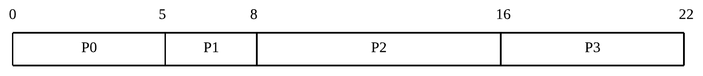

총처리시간은 `완료된시각 - 요청된시각`이고, 대기시간은 `큐에서 대기한 시간`이므로 각각을 구하고, 평균을 취하면 `평균 총처리시간`과 `평균 대기시간`을 얻을 수 있습니다.

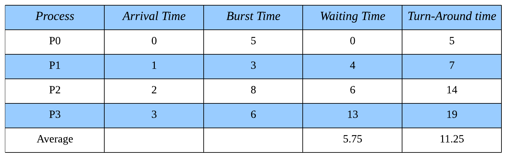

**총처리시간 계산 :**

-   `P0` : 0초 도착, 5초 완료이므로 `5(5-0)`초.
-   `P1` : 1초 도착, 8초 완료이므로 `7(8-1)`초.
-   `P2` : 2초 도착, 16초 완료이므로 `14(16-2)`초.
-   `P3` : 3초 도착, 22초 완료이므로 `19(22-3)`초.

평균 총처리시간은 `(5 + 7 + 14 + 19)/4`로 계산한 `11.25`초.

---

**대기시간 계산**

-   `P0 (Total 0초 대기)`
    -   첫 번째 대기 : 0초부터 0초까지 `0(0-0)`초 대기.
-   `P1 (Total 4초 대기)`
    -   첫 번째 대기 : 1초부터 5초까지 `4(5-1)`초 대기.
-   `P2 (Total 6초 대기)`
    -   첫 번째 대기 : 2초부터 8초까지 `6(8-2)`초 대기.
-   `P3 (Total 13초 대기)`
    -   첫 번째 대기 : 3초부터 16초까지 `13(16-3)`초 대기.

평균 대기시간은 `(0 + 4 + 6 + 13)/4`로 계산한 `5.75`초.

---

## Shortest Job First

직역하면 `최단 작업 우선, SJF 알고리즘` 입니다. `남은 시간이 가장 짧은 작업`을 선택합니다. 검사 시점에 따라 `선점형`, `비선점형`으로 나뉩니다.

---

### 비선점형

선점을 사용할 수 없으므로 `작업이 끝난 시점`에서 검사합니다.

`P0가 끝난 시점`에서 `P1, P2, P3` 모두 요청이 도착한 상태이므로 `셋 중에서 가장 Burst Time이 짧은 P1를 선택`합니다. 만약 `P1의 Arrival Time이 5보다 컸다면` P0이 끝난 시점에서 P1은 요청되지 않았으므로 고려되지 않았을 것 입니다.

시간이 흘러 P1이 끝난 시점에서, P2가 먼저 요청되었지만 P3의 버스트 시간이 더 짧기 때문에 스케쥴러는 P3을 선택합니다.

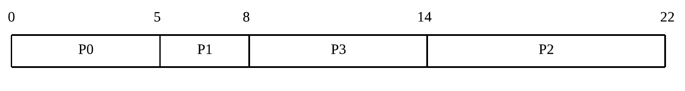

위의 타임라인을 보면 총처리시간과 대기시간을 쉽게 구할 수 있겠죠. `FCFS`보다 `평균 총처리시간과 평균 대기시간이 줄어든 것`을 확인할 수 있습니다.

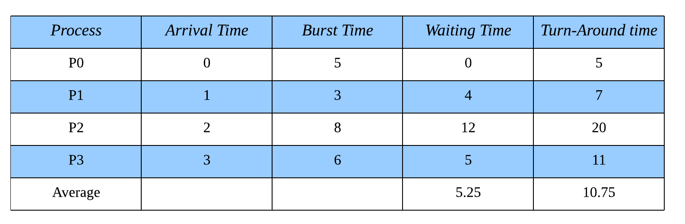

**총처리시간 계산 :**

-   `P0` : 0초 도착, 5초 완료이므로 `5(5-0)`초.
-   `P1` : 1초 도착, 8초 완료이므로 `7(8-1)`초.
-   `P2` : 2초 도착, 22초 완료이므로 `20(22-2)`초.
-   `P3` : 3초 도착, 14초 완료이므로 `11(14-3)`초.

평균 대기시간은 `(5 + 7 + 20 + 11)/4`로 계산한 `10.75`초.

---

**대기시간 계산**

-   `P0 (Total 0초 대기)`
    -   첫 번째 대기 : 0초부터 0초까지 `0(0-0)`초 대기.
-   `P1 (Total 4초 대기)`
    -   첫 번째 대기 : 1초부터 5초까지 `4(5-1)`초 대기.
-   `P2 (Total 12초 대기)`
    -   첫 번째 대기 : 2초부터 14초까지 `12(14-2)`초 대기.
-   `P3 (Total 5초 대기)`
    -   첫 번째 대기 : 3초부터 8초까지 `5(8-3)`초 대기.

평균 대기시간은 `(0 + 4 + 12 + 5)/4`로 계산한 `5.25`초.

---

### 선점형

이번에는 선점을 사용할 수 있으므로 `새로운 작업이 도착한 시점`에서도 검사할 수 있습니다.

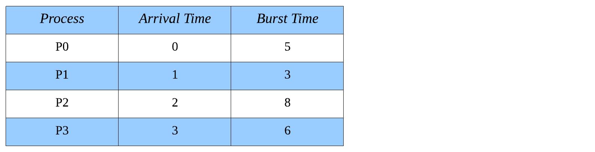

`P0 도중에 P1이 도착`했습니다. 현재 진행중인 작업을 끝내려면 4초가 더 필요하지만, P1을 끝내려면 3초면 되므로 `더 짧은 P1로 교체`합니다. 이후에 `P1이 처리되고 있는 도중에 P2, P3가 도착`하지만 P1이 더 짧으므로 교체되지 않습니다. P1이 완료되면 남은 시간이 가장 짧은(`4초가 남은`) P0가 선택됩니다.

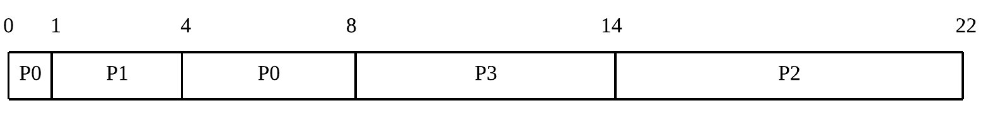

`총처리시간`은 지금까지와 마찬가지지만 `대기시간`은 약간 달라집니다. 중간로 선점되어 대기큐로 되돌아갔으므로 `다시 대기한 시간`을 포함해야 하기 때문입니다. 즉 `N 번째 대기시간`이 생겨났습니다.

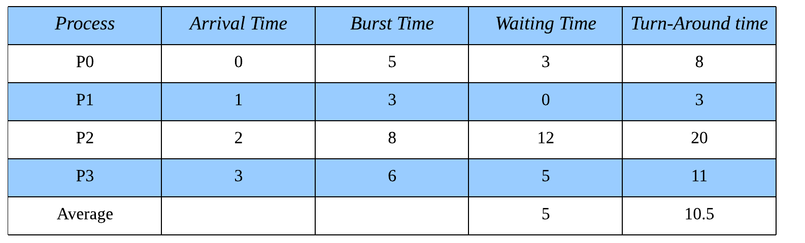

**총처리시간 계산 :**

-   `P0` : 0초 도착, 8초 완료이므로 `8(8-0)`초.
-   `P1` : 1초 도착, 4초 완료이므로 `3(4-1)`초.
-   `P2` : 2초 도착, 22초 완료이므로 `20(22-2)`초.
-   `P3` : 3초 도착, 14초 완료이므로 `11(14-3)`초.

평균 대기시간은 `(8 + 3 + 20 + 11)/4`로 계산한 `10.5`초.

---

**대기시간 계산**

-   `P0 (Total 3초 대기)`
    -   첫 번째 대기 : 0초부터 0초까지 `0(0-0)`초 대기.
    -   두 번째 대기 : 1초부터 4초까지 `3(4-1)`초 대기.
-   `P1 (Total 0초 대기)`
    -   첫 번째 대기 : 1초부터 1초까지 `0(1-1)`초 대기.
-   `P2 (Total 12초 대기)`
    -   첫 번째 대기 : 2초부터 14초까지 `12(14-2)`초 대기.
-   `P3 (Total 5초 대기)`
    -   첫 번째 대기 : 3초부터 8초까지 `5(8-3)`초 대기.

평균 대기시간은 `(3 + 0 + 12 + 5)/4`로 계산한 `5`초.

---

### 치명적인 단점

`SJF`은 고질적인 문제를 가지고 있습니다.

첫 번째는 `Burst Time이 큰 작업이 뒤로 계속 밀린다`는 것이죠. 짧은 작업들이 계속 요청되면, 버스트가 큰 작업의 순서는 영원히 오지 않을 것입니다. 이것을 `기아현상`(`Starvation`)라고 합니다.

두 번째는 `요청된 작업의 Burst Time을 계산할 수 없다`는 것 입니다. 예전에 실행했던 경험이 있는 작업이라면 과거의 기록에서 추정할 순 있지만, 정확하게 계산하는 것은 어렵습니다. 여러분은 처음 맡아본 업무의 소요시간을 정확하게 단언할 수 있나요?

---

## Priority

직역하면 `우선순위` 입니다. `미리 약속한 우선순위에 따라 다음에 실행될 작업을 결정`하며 우선순위가 남은 Burst Time이 짧은 것이라고 약속하면, SJF 알고리즘과 같아집니다. 즉, `SJF는 Priority의 특별한 케이스`입니다. 따라서 SJF의 특징을 생각하면 Priority의 특징도 얼추 파악할 수 있습니다.

1. `비선점` 또는 `선점`이 가능하다.
    - 비선점의 경우, 현재 작업이 끝나고 다음 작업을 결정
    - 선점의의 경우, 새로운 작업이 요청되었을 때에도 다음 작업을 결정
2. `기아현상`이 발생할 수 있다.

---

기아를 해결하는 한 가지 해결 방안은 `노화, Aging`입니다. 시간이 지남에 따라 우선순위를 점차 늘려주는 것 이죠. 처음에는 우선순위가 매우 낮은 작업도 `시간이 흐름에 따라 우선순위가 높아져` 언젠가는 실행될 것 입니다.

해당 알고리즘의 계산방법은 `SJF`와 같으므로 생략하겠습니다.

---

## Round Robin

라운드 로빈의 기본 원칙은 `모든 요소를 돌아가면서 순회`하는 것 입니다.

---

---

기본적인 동작은 `FCFS`와 같으나 `특정 시간`(`Quantum`)만큼만 실행하고, 퀀텀을 사용했는데도 미처 작업을 완료하지 못했다면 선점되어 대기큐의 마지막으로 돌아가고 `다음 작업을 다시 특정 시간만큼 실행`시킵니다. 이러한 특징으로 인해 `시분할 알고리즘`이라고 불리며 `특정 작업이 CPU를 독점하지 못하게 하는 것`과 같습니다.

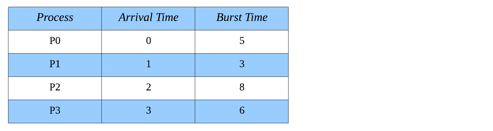

여기서는 `Quantum = 3`으로 정의하고 계산해보겠습니다.

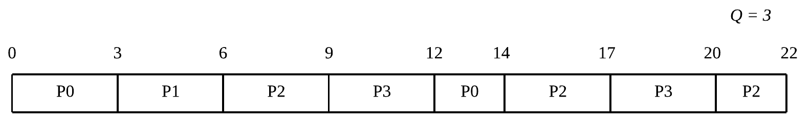

먼저 `P0`을 주어진 시간만큼만 실행하고, 그 다음으로 먼저 들어온 `P1`을 실행합니다. `P1`은 3초만으로 충분하므로 실행된 뒤에는 대기 큐에서 빠져나갑니다. 이것을 반복하면 다음과 같은 타임라인이 만들어집니다.

위의 타임라인을 보면 `총처리시간`과 `대기시간`을 간단하게 구할 수 있습니다. 각각의 작업들이 선점되어 대기큐로 돌아갈 수 있으므로 `N번째 대기시간`이 있다는 것을 염두해야 합니다.

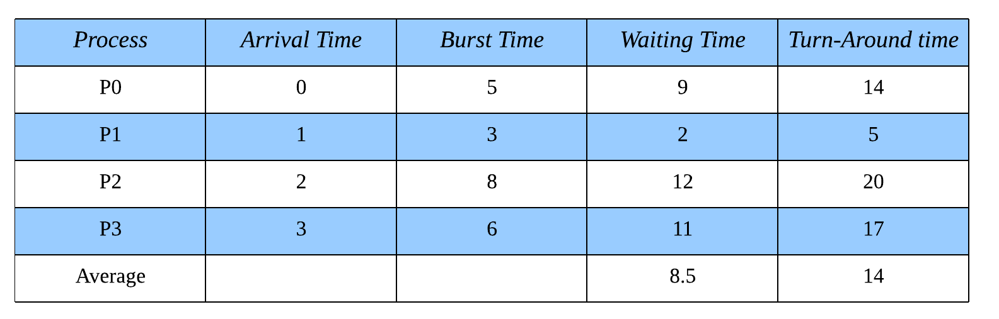

**총처리시간 계산 :**

-   `P0` : 0초 도착, 14초 완료이므로 `14(14-0)`초.
-   `P1` : 1초 도착, 6초 완료이므로 `5(6-1)`초.
-   `P2` : 2초 도착, 22초 완료이므로 `20(22-2)`초.
-   `P3` : 3초 도착, 20초 완료이므로 `17(20-3)`초.

평균 대기시간은 `(14 + 5 + 20 + 17)/4`로 계산한 `14`초.

---

**대기시간 계산**

-   `P0 (Total 9초 대기)`
    -   첫 번째 대기 : 0초부터 0초까지 `0(0-0)`초 대기.
    -   두 번째 대기 : 3초부터 12초까지 `9(12-3)`초 대기.
-   `P1 (Total 2초 대기)`
    -   첫 번째 대기 : 1초부터 3초까지 `2(3-1)`초 대기.
-   `P2 (Total 12초 대기)`
    -   첫 번째 대기 : 2초부터 6초까지 `4(6-2)`초 대기.
    -   첫 번째 대기 : 9초부터 14초까지 `5(14-9)`초 대기.
    -   첫 번째 대기 : 17초부터 20초까지 `3(20-17)`초 대기.
-   `P3 (Total 11초 대기)`
    -   첫 번째 대기 : 3초부터 9초까지 `6(9-3)`초 대기.
    -   첫 번째 대기 : 12초부터 17초까지 `5(17-12)`초 대기.

평균 대기시간은 `(9 + 2 + 12 + 11)/4`로 계산한 `8.5`초.

---

라운드 로빈은 `퀀텀의 크기`에 따라 성능이 좌우됩니다. 퀀텀이 크면 `FCFS`와 같아지므로 성능이 떨어지고, 퀀텀이 작으면 빈번하게 일어나는 `문맥교환`때문에 성능이 떨어집니다.

얼핏보면 `SJF`보다 성능이 떨어지는 것 처럼 보이지만, 두 알고리즘의 목표는 서로 다릅니다. `SJF`는 시스템의 처리량을 최대한 높이는 것을 목적으로 하고, `RR`은 모든 작업을 최대한 공평하게 다루는 것을 목적으로 합니다. 따라서 `RR`은 많은 사용자들이 동시에 사용하는 시스템에 적합합니다.

---

## Multilevel Queue

이것은 알고리즘이 아닌 `매커니즘`입니다. 작업의 특성마다 효율적인 스케줄링 방식이 다를 수 있음을 인정하기 때문에, 하나의 시스템에서 여러개의 `준비완료 큐`를 사용합니다.

당연하지만 각각의 큐는 `서로다른 스케쥴링 알고리즘`을 가질 수 있고, `큐 간의 우선도`도 서로 다를 수 있습니다.

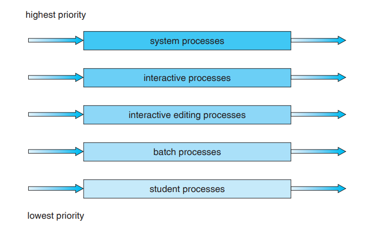

---

## Multilevel Feedback Queue

기존의 `Multilevel Queue`는 작업이 큐 사이를 이동할 수 없었지만 `MFQ는 서로다른 큐 사이의 작업이동을 허용`합니다.

`RR`로 구성된 큐를 생각해봅시다. 처음에는 `Q=8`에 삽입하여 짧은 퀀텀을 주다가, 생각보다 작업이 커서 오래 살아남는 것 같다면 `Q=16`로 이동시켜서 퀀텀의 크기를 늘려보고, 이래도 끝나지않으면 아예 `FCFS`로 이동시켜서 더 이상의 선점없이 작업을 끝낼 수 있습니다.

이것은 `Priority`를 사용하지 않고 `노화`를 구현한 것 입니다.

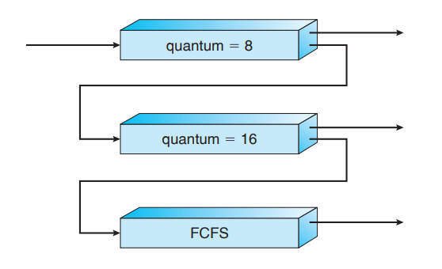
