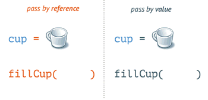
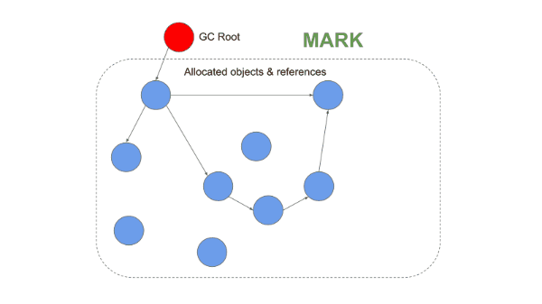
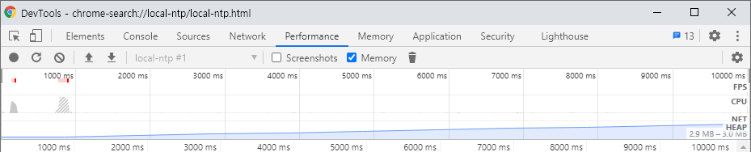

> # 개요

어느 프로그래밍 언어든지 마찬가지겠지만 해당 언어의 `내부 메모리 구조`와 `가비지 컬렉션 전략`을 이해하지 못하면 해당 언어가 낼 수 있는 최대의 성능을 올바르게 이끌어낼 수 없습니다. 유틸리티 정도의 작은 프로그램이라면 괜찮겠지만, 큰 규모의 프로그램을 작성해야 한다면 이야기는 달라지겠죠. 해당 포스트에서는 자바스크립트의 메모리 구조와 가비지 컬렉션에 대해 설명하고, 올바르지 않은 코딩 패턴에 대해 설명합니다.

---

> # 선행 지식

해당 포스팅을 이해하기 위해 필요한 지식들을 설명합니다.

---

## 참조형 변수

`C++`과 다르게 자바스크립트는 변수의 타입이 `참조형`인지 `값`인지 코드에서 명확하게 보이지 않으므로 처음에는 둘의 구분이 어려울 수 있지만, 실제로는 매우 쉽습니다. 다음 2가지만 기억하세요.

- 배열과 객체는 `레퍼런스(주소)`.
- 그 외의 모든것(리터럴)은 `값`.

---

배열과 객체는 `Reference`로, 그 외의 모든것은 `Value`로 저장된다는 것은 매우 중요한 특징입니다. 이것이 왜 중요한지 다음 2가지 코드를 보면서 설명하겠습니다.

```ts
let a = 3;
let b = a;
b++;
console.log(a, b); // 3 , 4
```

```ts
let a = [2, 1, 3];
let b = a;
b.sort();
console.log(a, b); // [1, 2, 3] , [1, 2, 3]
```

첫 번째 코드는 `a`와 `b`가 다르지만, 두 번째 코드에서는 `a`와 `b`가 서로 같다는 것에 눈치채야 합니다. `배열과 객체`의 대입은 `해당 데이터가 저장된 메모리의 주소`가 대입되는 것 이므로 `a`와 `b`가 가르키는 주소가 서로 같지만, `그 외의 모든것`의 대입은 `해당 데이터의 복제 값`이 대입되는 것 이므로 `a`와 `b`가 가르키는 주소가 서로 다르기 때문입니다.

---

따라서 `a`와 `b`가 다른 첫번째 코드는 `b`의 수정이 `a`에 영향을 끼치지 못했음을 알 수 있습니다.



---

## 클로저

대부분의 프로그래밍 언어에서와 마찬가지로 `함수가 종료되면 해당 함수의 모든 지역변수는 파기`되어야 합니다. 다음 `C++` 코드를 살펴보겠습니다.

```cpp
int* createValue(){
     int a = 3;
     return &a;
}
cout << *createValue() << '\n';
```

위의 코드는 잘못되었다는 것을 눈치채야 합니다. `a`는 함수가 종료되면 메모리에서 제거되므로 `cout`에 의해 콘솔에 쓰여지기 시작할 시점에서는 `a`가 이미 메모리에서 제거된 이후이므로, 사용해서는 안되는 주소이기 때문입니다.

---

그러나 자바스크립트는 다음과 같이 함수가 종료된 이후에도 `지역변수 a`가 제거되지 않도록 할 수 있습니다.

```ts
function createValue() {
  let a = 3;
  return function getA() {
    return a;
  };
}
const getA = createValue();
console.log(getA());
```

`지역변수 a`가 `getA`에 의해 참조되고 있으므로 자바스크립트는 함수가 종료된 이후에도 `지역변수 a`를 제거하지 않습니다. 따라서 위의 코드는 올바른 코드이며, 이와 같이 내부참조에 의해 지역변수의 파기를 늦추는 기능을 `클로저`라고 부릅니다.

---

추가적으로 아래의 코드는 클로저와 관계가 없습니다. 아래의 함수에 의해 반환된 `3`은 `지역변수 a`의 복제본이므로 `반환값의 주소`와 `지역변수 a의 주소`는 서로 같지 않습니다.

```ts
function createValue() {
  let a = 3;
  return a;
}
```

---

> # 메모리 구조

## 훑어보기


자바스크립트의 메모리 구조는 크게 `힙 영역`과 `스택 영역`으로 나눠집니다.

---

## 힙 영역

`참조형 데이터의 실체(배열, 객체)`와 `동적 데이터(배열, 객체에 사용된 리터럴 데이터)`가 저장되는 장소입니다. 전체 메모리 영역에서 대다수를 차지하고, 더 작은 세그먼트들이 모여서 만들어진 집합입니다. 이 중에서 `New 영역`과 `Old 영역`이 가비지컬렉션(`GC`)의 대상이 됩니다.

---

### New 영역 (Young Gen.)

최근에 만들어진 데이터가 저장되는 장소이며 `Minor GC(=Scanvenger)`의 대상입니다. `Old 영역`에 비해 매우 작으므로 가비지컬렉션이 매우 빈번하게 발생됩니다.

---

### Old 영역 (Old Gen.)

2번의 `Minor GC`에서 살아남은 객체들은 `Old 영역`으로 이동되며, 이후에는 `Major GC`에 의해 관리됩니다. 이 영역은 다시 세부적으로 아래와 같이 나눠집니다.

- `Old 포인터 영역` : 살아남은 객체들이 저장되어 있습니다.
- `Old 데이터 영역` : 살아남은 리터럴이 저장되어 있습니다.

---

### 라지 오브젝트 영역

다른 영역으로는 감당하지 못하는 매우 큰 객체들이 살고 있습니다. 해당 영역의 객체들은 가비지 컬렉터로 이동되지 않습니다.

---

### 코드 영역

컴파일러에 의해 컴파일된 코드가 저장되는 장소입니다. 유일하게 실행 가능한 데이터가 저장되어 있으며 `라지 오브젝트`영역에 할당될 수도 있습니다.

---

## 스택 영역

`변수`, `함수`, `클래스`, `함수 프레임`와 같은 정적 데이터가 저장되는 장소입니다.

---

### 변수

변수를 사용하기 위해서는 `스택 영역`에 해당 변수의 이름이 존재해야 합니다. 이것은 변수를 사용하려면 `먼저 스코프에 있어야 한다`는 말과 같습니다.

---

예를 들어, 아래의 코드는 `변수 a`가 스택에 없으므로(=스코프에 없으므로) 에러가 발생합니다.

```ts
console.log(a);
const a = 3;
```

또한, 중괄호를 기준으로 스코프가 열리고 닫히므로 다음 코드도 올바르지 않습니다.

```ts
{
  const a = 3;
}
{
  console.log(a);
}
```

---

### 함수, 클래스

기본적으로는 `변수`와 같지만 스택에 올라오는 시점이 조금 다릅니다. 컴파일러는 새로운 중괄호 단계에 들어서면, 해당 단계에 있는 모든 클래스와 함수를 미리 스택에 올려놓습니다. 즉, 아래의 코드들은 유효합니다.

```ts
const a = new Person("Hello");

class Person {
  name: string;
  constructor(name) {
    this.name = name;
  }
}
```

```ts
const a = sum(1, 2);

function sum(x: number, y: number): number {
  return x + y;
}
```

---

### 함수 프레임

중괄호(또는 함수)가 시작되고 끝날때 마다, 데이터가 스택에 올라오고 내려간다고 설명했습니다. 구체적으로는 함수가 시작할 때 마다 `새로운 함수 프레임`이 올라오고, 함수가 종료될 때 마다 `맨 위의 함수 프레임`이 제거됩니다.

---

위에서 설명했던 변수, 함수, 클래스는 모두 함수 프레임이 저장되어 있으므로, 함수가 종료되면 `함수 프레임과 함께 제거되므로` 기본적인 스코프의 내부원리도 설명할 수 있습니다. 또한 `console`, `window`, `process`와 같이 기본적으로 사용할 수 있는 객체들은 `전역 함수 프레임`에 저장되어 있으므로 `스택에 미리 올려져 있는 상태`와 같습니다.

---

추가적으로 `아직 외부에서 참조되고 있는 지역변수`는 `스택`이 아닌 `힙`으로 이동되어 함수가 종료되더라도 파기되지 않습니다. 이것을 `클로저`라고 부릅니다.

---

※ 코드의 실행에 따라 함수 프레임의 변화를 보고 싶다면 [여기](https://speakerdeck.com/deepu105/v8-memory-usage-stack-and-heap)를 눌러 확인해보세요.

---

# 메모리 관리

## Minor GC

흔히 `스케밴져`라고 불리는 `Minor GC`는 힙 영역중에서 `New 영역`을 관리합니다.


위의 그림과 같이 `New 영역`은 두개의 세미영역으로 나누어져 있고 각각 `From-영역`, `To-영역`이라고 부릅니다.

---

구체적인 스케벤져의 작동원리는 다음과 같습니다. (관련 슬라이드는 [여기](https://speakerdeck.com/deepu105/v8-minor-gc))

1. 새로운 데이터를 `From-영역`의 빈 공간에 할당하려고 시도한다.
2. 할당할 수 없다면, 스케벤져를 실행시켜 살려야 할 데이터를 선택한다.
3. 살릴 데이터만 `From-영역`에서 `To-영역`으로 이동시킨다.
4. 아직도 `From-영역`에 남아있는 데이터를 제거한다.
5. 이제 `To-영역`을 `From-영역`처럼 사용한다.

---

## Major GC

`Major GC`는 힙 영역중에서 `Old 영역`을 관리합니다.

---

### 종래의 전략

초기의 자바스크립트는 `참조 카운팅` 방식으로 불필요한 데이터를 파악했습니다. 쓰레기의 정의를 `누구도 사용하지 않는 데이터(=참조 카운팅이 0인 데이터)`로 내린 것이죠. 그러나 이 메모리 전략은 허점이 있었는데, 다음 코드를 보면서 설명하겠습니다.

```ts
function memoryLeak() {
  const a = {};
  const b = {};
  const c = {};
  a.b = b;
  b.a = a;
}
memoryLeak();
```

먼저 각각의 참조 카운팅을 계산해보겠습니다.

- `count(a)` : 1 -> `b.a`에서 사용되고 있음.
- `count(b)` : 1 -> `a.b`에서 사용되고 있음.
- `count(c)` : 0

더 이상 `a`와 `b`를 사용하고 있지 않음에도 불구하고, 서로가 서로를 참조하고 있는 바람에 참조 카운팅이 0이 될 수 없습니다. 위와같이 `순환참조`가 발생한 데이터는 가비지 컬렉터의 대상이 되지도 않죠. 해당 함수가 실행될 때 마다 `불필요하지만 반환이 불가능한 데이터`가 지속적으로 생성될 것 입니다. 이것을 흔히 `메모리 누수`라고 합니다.

---

좀 더 복잡한 `순환참조`는 프론트엔드 프로그래밍에서 매우 빈번하게 발생됩니다. 다음 코드를 살펴보겠습니다.

```ts
let div = document.getElementById("id");
div.onclick = function handler() {
  doSomething();
};
```

`참조 카운팅`은 반드시 직접적인 참조만 계산하지 않습니다. 스코프에만 존재해도 참조로 셉니다. 따라서 `handler`가 직접적으로 `div`를 참조하고 있지는 않지만 `handler`의 스코프에 `div`가 존재하므로 `handler도 div를 참조하고 있다`라고 말할 수 있습니다.

---

`div`가 `handler`를 참조하고 있고 `handler`가 `div`를 참조하고 있으므로 완벽한 순환참조가 완성됩니다. 익스플로러 6, 7은 `참조 카운팅` 방식을 채택하고 있으므로, 해당 브라우저에서 위의 코드를 실행시키면 실제로 메모리 누수가 발생합니다.

---

### 근래의 전략

위와 같은 이슈로 인해 근래에는 `Mark Sweep (And Compact)` 방식을 사용합니다. 핵심 원리는 `Root`에서 닿을 수 있는 데이터만 `표시(Mark)`하고 마킹되지 않은 데이터는 `청소(Sweep)`하는 것입니다. 따라서 이 전략은 `루트에서 닿을 수 없는 데이터`를 쓰레기로 정의합니다.

---

실제로 `V8`이 사용하고 있는 `Major GC`는 다음 3가지의 세부 동작을 실행합니다.

- `Mark` : 루트에서 시작해서 닿을 수 있는 데이터에 표시를 한다.
- `Sweep` : 마크되지 않은 데이터를 전부 삭제한다.
- `Compact` : 단편화를 줄이기 위해 데이터를 한쪽으로 끌어모은다. (=디스크 조각 모음)



```ts
function memoryLeak() {
  const a = {};
  const b = {};
  const c = {};
  a.b = b;
  b.a = a;
}
memoryLeak();
```

따라서 위의 함수가 실행되더라도 `a`와 `b`는 더 이상 `루트에서 닿을 수 없으므로` 가비지 컬렉터의 대상이 됩니다.

---

# 메모리 누수

## 원인

`Mark Sweep Compact` 방식을 채택하여 `순환참조`로 인한 메모리 누수는 사라졌지만 모든것이 해결된 것은 아닙니다. 다음은 메모리 누수가 발생하는 대표적인 원인들입니다.

- 전역변수
- 다중참조
- 클로저
- 콜백함수

---

### 전역변수

사용하지 않는 전역변수는 `루트에서 닿을 수 있지만 사용하지 않는 데이터`의 대표적인 예시입니다. 전역변수는 항상 루트에서 도달할 수 있으므로, 결코 가비지 컬렉터에 의해 수집되지 않습니다. 이러한 현상이 발생하는 케이스는 다음과 같습니다.

- `window` 또는 `globalThis`에 직접 할당
- `globalContext`에서 변수 생성

```ts
//
// window 또는 globalThis에 직접 할당
for (let i = 0; i < 12345; i++) {
  window["v" + i] = i;
  globalThis["v" + i] = i;
}
```

```ts
//
// `globalContext`에서 변수 생성
const x = 1;

//
// const, var, let 없이 변수를 생성한 경우 global 스택에 할당됨.
function a() {
  y = 3;
}
a();

//
// 익명함수의 this는 직전 중괄호 레벨을 따름.
// 여기서는 직전 중괄호 레벨이 global 이므로,
// 아래의 this는 globalThis와 같음.
const b = () => {
  this.z = 5;
};
b();

console.log(x); // 1
console.log(y); // 3
console.log(z); // 5
```

---

### 다중참조

참조형으로 전달되는 데이터(`배열` 또는 `객체`)가 여러 변수에서 사용되고 있을 때, 하나라도 참조가 살아있다면 결코 가비지 컬렉터의 대상이 되지 않습니다.

```ts
//
// y는 50% 확률로 x에 대한 참조를 획득함.
let x = {};
let y = undefined;
if (Math.random() < 0.5) {
  ref[i] = x;
}

//
// x를 null로 제거했지만 y가 x에 대한 참조를 획득했다면,
// 가비지 컬렉터의 대상이 되지 않으므로, 메모리에 남아있음.
x = undefined;
```

---

### 클로저

클로저로 인해 지역변수가 힙으로 이동되었다면, 클로저가 제거될 때 까지 가비지 컬렉터의 대상이 되지 않습니다.

```ts
function createClosure() {
  const a = 3;
  function closure() {
    return a;
  }
  return getA;
}
let closure = createClosure();
// 클로저 함수를 통해 a에 접근할 수 있으므로,
// 현재 시점에서 아직 a는 힙에 살아있습니다.

closure = undefined;
// 이제 a에 접근할 방법이 없으므로,
// 가비지 컬렉터에 의해 힙에서 제거됩니다.
```

---

### 콜백함수

콜백함수는 그 자체가 원인은 아니지만 메모리 누수가 발생할 수 있는 `매우 유력한 지점`입니다. 위의 원인 중 하나라도 콜백함수에 섞여들어가면 메모리 누수가 발생합니다.

```ts
//
// 콜백함수가 전역변수를 지속적으로 생성하여 메모리 누수 발생.
let i = 0;
setInterval(() => {
  //
  // 아래의 this는 globalThis와 같음.
  this["val" + i] = i;
  i++;
}, 1000);
```

```ts
//
// 해제되지 않는 클로저
// 클로저 자체가 지속적으로 생성되는 것도 문제지만,
// 지역변수 local이 결코 가비지 컬렉터의 대상이 되지 않음.
const closures = [];
setInterval(() => {
  const local = 1;
  function closure() {
    return local;
  }
  closures.push(closure);
}, 1000);
```

---

## 회피 패턴

메모리 누수의 발생확률을 줄일 수 있는 방법은 다음과 같습니다.

- 전역변수의 생성 최소화하기
- 힙 데이터를 스택으로 끌어내리기
- 다중참조 막기

---

### 전역변수 생성 최소화

1. 가능하면 전역변수를 대신에 지역변수로 선언하세요.
2. 전역선언이 불가피한 경우 그 수와 용량을 최소화해야 합니다.
3. 전역변수를 다 사용했다면 `null`로 바꿔넣어 가비지 컬렉터의 대상이 되게 하세요.

---

### 힙 데이터를 스택으로 끌어내리기

메모리 구조의 특성상 `힙`보다 `스택`이 훨씬 빠릅니다. `Object Destructure`라고 알려진 문법을 사용하여 객체의 각 필드를 스택 메모리로 끌어내리면 성능면에서 좋아집니다.

```ts
function sum(obj) {
  //
  // obj.a와 obj.b가 지역변수로 끌어내려짐.
  const { a, b } = obj;

  //
  // 다음과 같이 해도 됩니다.
  const a = obj.a;
  const b = obj.b;

  //
  // a, b는 스택에서 가져오므로 훨씬 빠릅니다.
  return a + b;
}
```

---

### 다중참조 막기

메모리 누수의 또 다른 근본적 원인은 `다중참조`입니다. 가능하면 원본 객체의 참조를 전달하는 것 보다는 `Object Spread` 또는 `Object.assign()`을 사용하여 복사본을 생성하고, 그것의 참조를 넘겨서 `같은 객체의 다중참조 가능성`을 낮추세요. 객체가 커서 오버헤드를 무시할 수 없는 경우에만 원본 객체의 참조를 넘기세요.

```ts
//
// Object Spread (전개 구문)
const a = {
  x: 0,
  y: 0,
};
const b = { ...a };

b.x++;
console.log(a); // x:0, y:0
console.log(b); // x:1, y:0
```

```ts
//
// Object.assign(holder, data);
// data의 데이터를 holder로 옮깁니다.
// 해당 함수의 리턴값은 holder의 참조값입니다.
const a = {
  x: 0,
  y: 0,
};
const holder = {};
const b = Object.assign(holder, a);

a.x++;
console.log(a); // x:0, y:0
console.log(b); // x:1, y:0
console.log(holder); // x:1, y:0
```

---

## 누수 검사

### 프론트엔드

브라우저에 내장된 메모리 프로파일러를 사용하면, 메모리 누수를 쉽게 확인할 수 있습니다. 메모리 누수는 `생성만 되고 반환되지 않는 상태` 이므로, 메모리 사용량이 `상승곡선`을 그리면 메모리 누수가 발생한 것입니다.

---

메모리 누수를 발생시키는 코드를 실행시키고, 프로파일링을 해보겠습니다.

```ts
//
// 콜백함수가 전역변수를 지속적으로 생성하여 메모리 누수 발생.
let i = 0;
setInterval(() => {
  //
  // 아래의 this는 globalThis와 같음.
  this["val" + i] = i;
  i++;
}, 1000);
```

메모리 누수가 발생하여 힙 사용량이 `상승곡선`을 그리는 것을 확인할 수 있습니다. (클릭하여 크게 볼 수 있습니다.)



---

### 백엔드

`NodeJS`는 `기본 inspector` 또는 `추가적인 메모리 누수 관측기`를 사용하면 됩니다.
