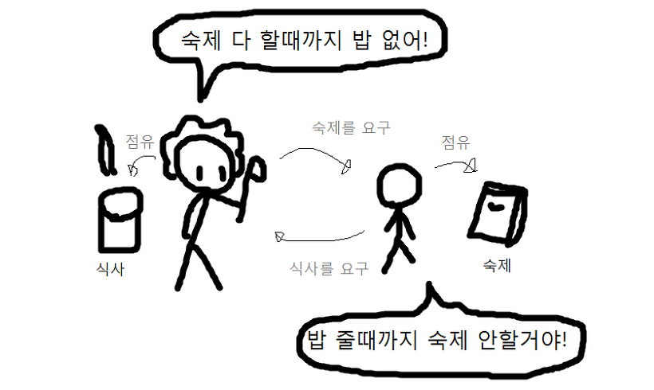
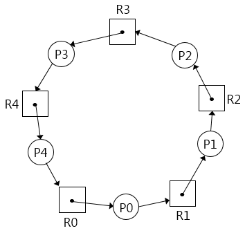
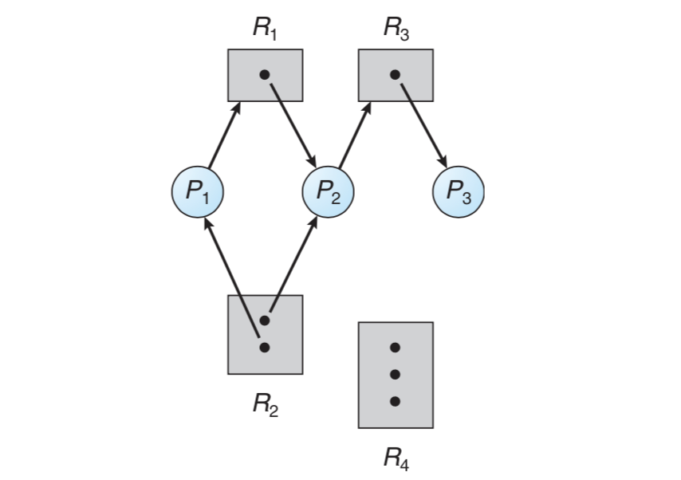
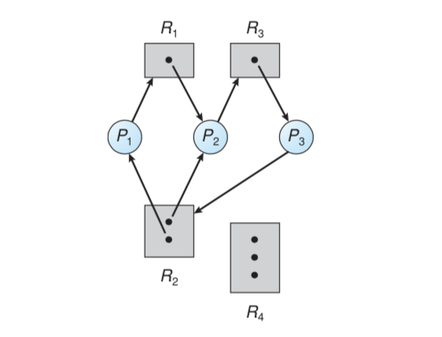
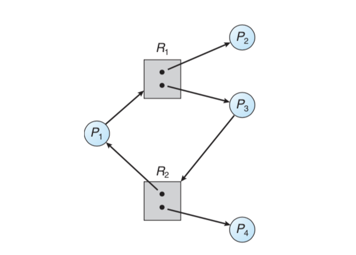
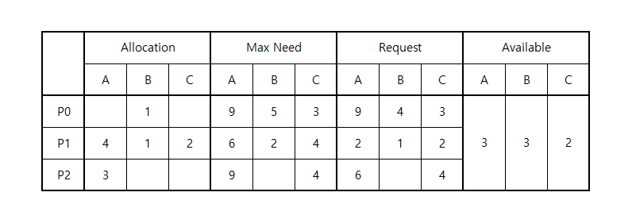
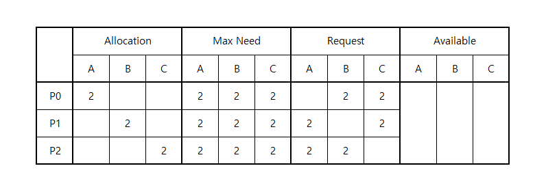
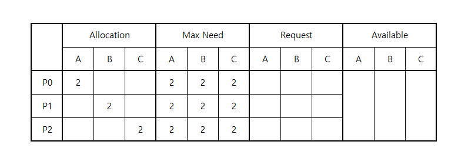
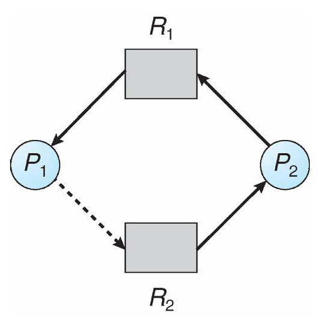

# 교착상태

## 개요

이전 챕터인 `프로세스 동기화`을 떠올려보면 공유자원을 요청한 작업은 해당 공유자원이 `자신에게 할당될 때 까지 대기`하고 있음을 알 수 있습니다. 그러나 지금까지는 공유자원이 1개인 작업만을 이야기했지만, 공유자원이 2개 이상 필요한 작업의 경우에는 어떨까요?

이러한 경우에는 `교착상태`라는 특이한 문제가 생길 수 있습니다. 두 개의 작업이 각각 고유자원을 소지하고 있는 상태에서, 상대의 고유자원을 요청하고, 반대편이 그것을 내놓을때 까지 기다리는 상황이죠. 양쪽 모두 고유자원을 내놓을 생각이 없다면, 이 둘은 반대편이 고유자원을 내놓길 기다리면서 영원히 대기하게 됩니다.



**이미지 출처 :** [땔감툰](https://pubul.tistory.com/36)

---

## 필요조건

교착상태가 발생하려면 아래의 조건을 모두 만족해야 합니다.

1. `상호배제` : 각 공유자원은 하나의 작업에만 점유될 수 있음.
2. `점유대기` : 작업은 하나 이상의 고유자원을 점유한 상태에서, 새로운 고유자원을 요청함.
3. `비선점` : 운영체제는 작업의 고유자원을 강제로 뺏을 수 없음.
4. `순환대기` : 각 작업들은 꼬리에 꼬리를 물며 상대편의 고유자원을 요청함.



---

## 자원할당 그래프

교착상태를 가시화할 수 있는 좋은 방법은 자원할당 그래프입니다. `작업`, `자원`, `요청`으로 구성된 그래프를 만들어 `사이클`이 있는지 검사하면 됩니다. 필요조건에서 있었던 `순환대기`가 그래프에 나타났는지 확인하는 것 입니다.

**각 자원의 개수가 1개인 경우 :**

-   `사이클이 없다면` : 교착상태도 없다.
-   `사이클이 있다면` : 교착상태가 있다.

**각 자원의 개수가 1개 이상 경우 :**

-   `사이클이 없다면` : 교착상태도 없다.
-   `사이클이 있다면` : 교착상태가 있을수도 있고, 없을수도 있다.

---

### 사이클이 없는 경우



사이클이 없다면 교착상태도 아닙니다. 위의 예시에서 `P3`이 작업을 완료하면 `P2`가 진행할 수 있고, `P2`가 작업을 완료하면 `P1`이 진행할 수 있기 때문입니다.

---

### 사이클이 있고 데드락



**사이클 :**

```
P1 → R1 → P2 → R3 → R2 → P1
P2 → R3 → P3 → R2 → P2
```

이전 그림에서 요청간선을 하나 그은 것 뿐인데 교착상태가 되었습니다. `P3`이 작업을 완료하려면 `R2`가 필요한데 `P1, P2`가 해당 자원을 모두 점유했기 때문에 진행할 수 없습니다. 따라서 `P1, P2`가 먼저 작업을 완료해야 하는데, 같은 이유로 작업을 진행할 수 없습니다.

---

### 사이클이 있지만 데드락이 아님



**사이클 :**

```
P1 → R1 → P3 → R2 → P1
```

각 자원이 여러개 존재하는 경우에는, 사이클이 있다고 반드시 데드락인 것은 아닙니다. 위의 그림에서는 `P4 → P3 → P1` 순서대로 작업이 완료될 수 있습니다.

---

# 교착상태 처리

교착상태를 처리하는 방법은 3가지가 존재합니다.

1. 교착상태가 애초에 발생하지 않게끔 예방하거나 회피한다.
2. 교착상태를 허용하고, 교착상태를 감지했을 때 회복한다.
3. 교착상태를 무시하고, 시스템은 모르는 척 한다.

앞의 2개는 운영체제가 앞장서서 교착상태를 처리하는데 반해, 맨 마지막 방법은 응용 프로그래머가 알아서 교착상태를 해결해야합니다. 교착상태가 발생하더라도 시스템은 모르는 척 하기 때문이죠.

앞선 두 방법이 프로그래머에겐 편리할지 몰라도, 운영체제는 모든 공유자원의 현황과 모든 작업의 고유자원 요청정보를 파악해야 합니다. 그러나 운영체제가 모든 것을 감시한다는 것은 현실적으로 어려우므로, 현대의 운영체제는 세 번째 해결안을 사용합니다.

---

## 교착상태 예방

교착상태가 발생하려면 4가지 필요조건이 `전부` 갖춰져야 한다고 했습니다. 그렇다면 `하나라도 무너트리면` 교착상태를 피할 수 있다는 것이 아닐까요? 교착상태의 예방은 이러한 아이디어에서 출발합니다.

**교착상태의 필요조건 :**

1. `상호배제` : 각 공유자원은 하나의 작업에만 점유될 수 있음.
2. `점유대기` : 작업은 하나 이상의 고유자원을 점유한 상태에서, 새로운 고유자원을 요청함.
3. `비선점` : 운영체제는 작업의 고유자원을 강제로 뺏을 수 없음.
4. `순환대기` : 각 작업들은 꼬리에 꼬리를 물며 상대편의 고유자원을 요청함.

---

### 상호배제 제거

공유자원이 여러 작업들에 의해 점유될 수 있다면 교착상태는 발생하지 않습니다. 그냥 가져다 쓰면 되므로 대기할 필요가 없기 때문이죠. 그러나 `비일관성` 문제가 발생할 수 있으므로 공유자원이 `읽기전용`인 경우에만 가능하며, 보편적으로 공유자원은 동시에 점유될 수 없는 것이 많으므로 일반적인 방법이 아님을 상기해야 합니다.

**읽기전용 파일 :**

-   여러 작업에 의해 동시 점유가 가능.
-   작업에 의해 수정될 수 없기 때문에 일관성 유지 가능.

---

### 점유대기 제거

점유한 자원이 없는 경우에만 자원을 요청할 수 있으며, 필요한 모든 자원은 모두 한꺼번에 얻도록 강제함으로써 구현할 수 있습니다. 그러나 나중에 필요한 자원들도 미리 얻어내기 때문에 `자원의 사용률이 낮아지고` 자주 사용되는 인기 자원들은 `기아현상이 발생`할 수 있습니다.

---

### 비선점 제거

어떤 작업이 사용 불가능한 자원을 요청할 경우, 2가지 방법 중 하나를 선택함으로써 구현할 수 있습니다.

1. 요청을 시도한 작업의 모든 자원을 빼앗고, 롤백시킨다.
2. 다른 작업에서 자원을 빼앗고, 돌려받을 때까지 정지시킨다.

이 방법은 `CPU 레지스터`나 `메모리 공간`과 같이 상태가 존재하고 복구될 수 있는 자원에 대해서만 사용할 수 있습니다. `프린터`처럼 상태가 존재하지 않거나 `테이프 드라이브`같이 상태가 복구될 수 없는 자원에는 적용될 수 없습니다.

---

### 순환대기 제거

각 자원의 우선순위를 명확히 지정하면 순환대기를 제거할 수 있습니다. 같은 종류의 작업(`요구하는 자원의 종류와 개수가 같은 작업`)이 우선순서에 따라 자원을 요청하면 자원할당 그래프가 엇갈리지 않음을 보증할 수 있기 때문입니다. 그러나 다른 종류의 작업에 대해서는 통하지 않기 때문에 `우선순위를 둔 것 만으로 교착상태가 예방되진 않는다`는 것을 알아야 합니다.

---

## 교착상태 회피

### 안전상태

다음 정보들이 주어졌을 때, 해당 요청들을 모두 이뤄줄 수 있는 상태를 `안전상태`라고 하며, 그 요청을 이루어가는 순서를 `안전순서`라고 부릅니다.

-   `Available` : 현재 시스템의 가용자원
-   `Allocation` : 각 작업이 점유중인 자원 정보
-   `Max Need` : 각 작업이 필요로하는 자원의 최대량
-   `Request` : 각 작업이 현재 요청한 자원 정보

---

아래의 요청은 `P1 → P2 → P0` 순서대로 진행하면 모든 요청을 이루어줄 수 있으므로 안전상태에 있습니다.



-   `STEP 1`
    -   가용가능한 자원에서 P1에 `{2, 1, 2}`만큼 추가로 할당합니다.
    -   P1이 끝나면 시스템의 가용량은 `{7, 4, 4}`가 됩니다.
-   `STEP 2`
    -   가용가능한 자원에서 P2에 `{6, 0, 4}`만큼 추가로 할당합니다.
    -   P2가 끝나면 시스템의 가용량은 `{10, 4, 4}`가 됩니다.
-   `STEP 3`
    -   가용가능한 자원에서 P0에 `{9, 4, 3}`만큼 추가로 할당합니다.
    -   P0가 끝나면 시스템의 가용량은 `{10, 5, 4}`가 됩니다.

---

반면에 모든 요청을 이뤄줄 수 없다면 `불안전상태`에 있다고 하며, `시스템이 불안정하다`라고 표현합니다. 자원할당 그래프처럼 `모든 사이클이 교착상태가 아님`인 것 같이 자원할당 테이블도 `모든 불안정상태가 교착상태가 아님`인 것을 유의해주세요.

---

**교착상태가 발생한 불안전상태 :**



위의 경우에는, 어떠한 요청도 들어줄 수 없습니다.

---

**교착상태가 없는 불안전상태 :**



작업들이 필요한 자원을 한꺼번에 요청한다라는 것은 선입견입니다. 위의 테이블은 불안전한 상태이지만 `지금은 어느 작업도 추가적인 자원을 요청하지 않았습니다`. 여기서 추가적인 자원을 요청한다면 교착상태로 넘어가지만, 반대로 세 작업 중 하나라도 종료된다면 안전순서가 생기게됩니다.

---

### 안전상태를 계산하여 회피

교착상태 회피는 `사이클` 또는 `불안전상태`를 방지하면 결코 교착상태가 발생하지 않는다는 아이디어에서 출발합니다. 모든 작업의 요청을 검사해서, 요청을 들어줬을 때의 안정성을 확인하는 것이죠.

그러나 운영체제가 항상 모든 작업의 요청을 검사해야 하기 때문에 `자원의 이용률이 저하`되고 `시스템의 처리율도 감소`합니다. 마지막으로 작업에게서 자원에 관한 모든 정보들을 받는것은 현실적으로 힘듭니다.

---

**사이클을 통한 회피 :**

해당 요청을 들어줬을 때, 사이클이 발생하지 않는 경우에만 수락합니다. 이 방법은 `각 자원의 개수가 1개인 경우`에만 사용할 수 있는데, 각 자원의 개수가 N개 이상이라면 사이클이 반드시 교착상태라고 단정할 수 없기 때문입니다.



**불안정상태를 통한 회피 :**

`은행원 알고리즘`(`Banker's Algorithm`)으로 알려진 이 방법은, 새로운 요청을 포함하여 안전순서가 있는지 검사한 뒤에 수락여부를 결정합니다. 안전순서를 계산하는 것은 이미 위에서 다뤘기 때문에 패스하지만, 은행원 알고리즘은 `각 작업이 필요한 모든 자원을 한꺼번에 요청함`을 가정합니다. 즉, 항상 `Request = Max Need - Allocation`임에 주의해야 합니다.

사이클 판정법과는 달리 `각 자원이 여러개 있어도 사용할 수 있지만` 자원들의 최대 사용량, 현재 보유량, 가용량 등을 미리 알아야 하므로 `현실적으로 조금 힘듭니다`.

---

## 교착상태 탐지

시스템이 예방이나 회피를 사용하지 않는다면, 정기적으로 교착상태를 탐지하고 회복하는 루틴이 필요합니다.

---

**사용하는 알고리즘 :**

-   `각 자원이 1개인 경우` : 사이클 검사만으로 충분합니다.
-   `각 자원이 N개인 경우` : 은행원 알고리즘으로 안전순서가 있는지 검사합니다.

---

**탐지 알고리즘 수행시점 :**

기본적으로 교착상태가 발생하는 시점은 `새로운 자원을 요청했을 때`이므로, 요청을 들어줄 때 마다 탐지 알고리즘을 돌리는 것이 이상적입니다. 어떤 요청에 의해 교착상태가 발생했는지도 알 수 있죠. 그러나 매 요청마다 탐지 알고리즘을 돌리는 것은 너무나 비효율적입니다.

따라서 다른 방법으로 접근해야 합니다. 교착상태에 빠진 작업은 CPU를 사용하지 않으므로 `CPU 이용률이 40% 이하일 때` 탐지 알고리즘을 실행하면 시스템 처리량을 늘릴 수 있습니다. 다만, 이미 교착상태에 빠진지 한참되었기 때문에 교착상태에 얽힌 프로세스가 많아지고, 누가 교착상태를 일으켰는지 알 수 없게됩니다.

---

## 교착상태 회복

탐지 알고리즘을 통해 교착상태를 발견했다면, 다음 두 가지 방법 중 하나를 선택하여 교착상태를 끊어낼 수 있습니다.

1. 얽힌 프로세스를 중지시킨다.
2. 얽힌 프로세스의 자원을 뺏는다. (선점한다.)

---

### 프로세스 중지

프로세스를 중지하는 경우에도 2가지 선택지가 있습니다.

1. 얽힌 모든 프로세스를 중지.
2. 교착상태가 없어질 때 까지 하나씩 중지.

모든 프로세스를 중지시킨다면 확실하게 교착상태를 없앨 수 있지만, 지금까지 작업들이 연산했던 결과들을 전부 잃어버리기 때문에 비용이 너무나 큽니다.

반대로 하나씩 중지시키는 방법은, 매 작업을 종료할 때 마다 아직도 교착상태에 있는지 검사해야 하므로, 교착상태 탐지로 인한 오버헤드가 커지게됩니다.

---

### 자원 선점하기

교착상태가 깨질 때 까지, 얽힌 프로세스에서 희생자를 하나 선택하여 자원을 지속적으로 빼앗습니다. 자원을 빼앗긴 작업은 정상적인 실행이 불가능해지므로 이전 상태로 롤백해야 하지만, 비용이 너무 비싸기 때문에 보통 중지시키고 재시작시킵니다.

만약 자원을 하나씩 빼앗는 시스템인 경우에는 `기아현상`을 염두해야 합니다. 특정 작업이 계속해서 희생자로 선택될 수 있기 때문입니다. 이 현상을 막으려면 우선 순위에 희생횟수를 포함해야 합니다.
