# 기본 하드웨어

`CPU`가 직접적으로 접근할 수 있는 메모리는 `CPU 레지스터`와 `RAM`이 유일하며, 이외의 메모리는 CPU가 해당 메모리의 주소를 가져오는 것이 불가능합니다.

이 때 `CPU 레지스터`는 단일 클럭만에 연산이 가능한데 반해, `RAM`은 메모리 버스를 경유해야 하기 때문에 훨씬 많은 클럭이 소요되므로, 이 속도차이를 보완하고자 중간에 `캐시 메모리`를 둘 수 있습니다.

---

# 프로세스 메모리

## 프로세스 메모리 범위

각각의 프로세스는 자신만이 사용할 수있는(`legal`) 메모리 공간을 가지며, 운영체제는 각 프로세스가 합법적인 메모리 영역에만 접근할 수 있도록 강제해야 합니다. 따라서 현대 시스템은 `기준 레지스터`(`BASE`)와 `상한 레지스터`(`LIMIT`)를 두어 합법적인 메모리 영역을 표현하는데, 일반 프로세스는 `[BASE, BASE + LIMIT)` 내에서만 메모리를 조작할 수 있습니다.

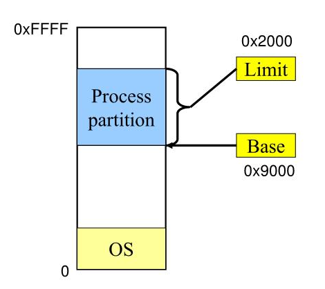

-   `기준` : 0x9000
-   `상한` : 0x2000
-   `Legal Memory Range` : [0x9000, 0x9000 + 0x2000)

---

단, 커널 프로세스는 이러한 제약을 받지 않기때문에, 운영체제는 `사용자 프로그램을 메모리에 적재`하거나 `에러가 발생하면 덤프를 뜨는 등`의 일들을 수행할 수 있습니다.

---

## 프로세스 바인딩

### 바인딩 시점에 따른 분류

프로세스의 메모리 범위를 결정하는 것을 바인딩(`Binding`)이라고 하며, 바인딩을 수행하는 시점에 따라 다음과 같이 분류할 수 있습니다.

-   `Compile-Time Binding`
    -   프로그램을 컴파일 할 때 메모리 범위를 결정.
    -   범위가 달라지면 재컴파일 해야한다.
    -   다른 프로그램의 메모리 범위가 겹치지 않도록 프로그래머가 주의해야 함.
    -   도스 시절에나 쓰던 방식.
-   `Load-Time Binding`
    -   프로그램이 램에 적재되기 전에 `BASE`와 `LIMIT`을 결정.
    -   다른 프로그램의 메모리 범위가 겹치지 않도록 운영체제가 관리함.
    -   현대 시스템에 채택됨.
-   `Run-Time Binding`
    -   실행중에 운영체제에 의해 다른 메모리 주소로 옮겨질 수 있음.
    -   적재시간 바인딩을 기본적으로 포함함.
    -   특수한 하드웨어가 필요함.

---

### 논리주소와 물리주소

CPU가 취급하는 주소를 `논리주소`, 해당 논리주소에 연관된 실제 메모리의 주소를 `물리주소`라고 합니다. 간단하게 생각하여 `Load-Time Binding`에서 CPU가 프로그램에게 전달하는 주소의 범위는 `[0, LIMIT)`이지만, 실제로 접근해야 하는 범위는 `[R, R + LIMIT)`입니다.

프로그램이 논리주소를 통해 데이터를 요청하면, 운영체제는 해당 논리주소를 물리주소로 변환해야 하며, 이러한 역할을 수행하는 장치를 `MMU`(`Memory Managemnt Unit`)이라고 합니다.

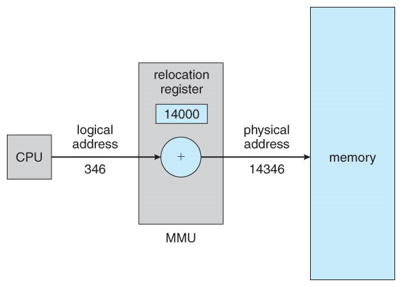

---

## 동적 적재

현대 시스템에서 코드가 실행되려면 메인 메모리에 미리 적재되어 있어야 하지만 `가~끔 실행되는 주제에 매우 큰 코드`를 처음부터 적재하는 것은 매우 비효율적입니다. 따라서, 일부 코드는 메인 메모리에 미리 적재되지 않도록 설정할 수 있습니다.

이런 코드들은 실제로 프로그램에 의해 호출되기 전까지 메모리에 적재되지 않으며, 메모리에는 `stub`으로 불리는 재배치 가능 요소로 대체됩니다. 이후에 스텁을 만나면 진행을 잠깐 멈췄다가 `해당 스텁이 가르키는 경로의 코드`를 적재한 뒤에 작업을 재개합니다. 윈도우에서 말하는 `.dll`파일이 이러한 종류이며, 이런 전략을 `Dynamic Loading`, `Dynamic Linking`, `Shared Library`라고 부릅니다.

원래 이러한 전략을 구현하는 것은 본래 프로그래머가 알아서 해야하는 것이지만, 운영체제가 동적 적재를 지원하는 인터페이스를 제공하여 프로그래머에게 도움을 줄 수 있습니다.

---

## 고전적 스와핑

### 스와핑이란?

현대 시스템은 `선점`이 허용되어 있으므로, 진행하던 작업을 멈추고 다른 작업을 수행해야 하는 경우가 생길 수 있습니다. 그러나 멈춘 작업들을 메모리에 계속 내버려둔다면 새로운 프로세스를 더 받아들일 수 없으므로, `프로세스를 디스크로 빼냈다가 다시 적재`하는 기능이 요구되었습니다. 이것을 `스와핑`이라고 합니다.

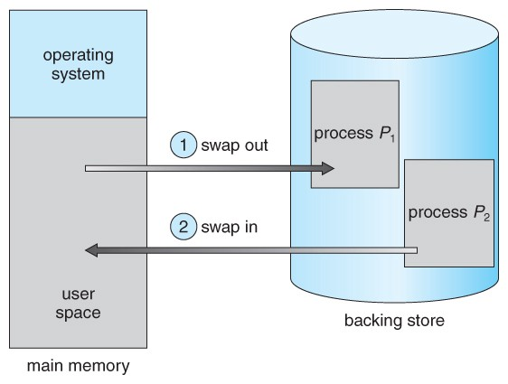

### 디스패처

스와핑에 의해 작업이 메모리에 적재되어 있지 않을 가능성이 생겼으므로, 실행할 작업이 메모리 적재되어 있는지 검사하는 프로그램이 필요해졌습니다. 이것을 `디스패처`라고 하며, 메모리에 적재되어 있는지 검사하고, 메모리에 없다면 이미지를 재적재시킵니다.

---

### 단점

**문맥교환 비용의 증가 :**

고전적 스와핑은 `보조 기억장치`에 작업을 백업하기 때문에, 기억장치의 속도가 느리면 스와핑의 속도도 같이 느려졌습니다. 스와핑은 문맥교환시에 발생하므로 `문맥교환의 비용이 대폭 증가`한 것과 같습니다. 이것은 짧은 주기의 라운드 로빈 시스템에서 매우 치명적입니다.

---

**시스템 처리율 감소 :**

그리고 스와핑에만 매달리는 바람에 작업을 수행할 시간이 부족하므로 `시스템의 처리율도 감소`합니다.

---

**재배치 이슈 :**

스와핑에 의해 보조기억장치로 날아간 작업이 다시 돌아와야 할 때 `BASE 레지스터`를 어떻게 할것인지에 대한 고민도 필요합니다. 이전과 같은 장소로 배치된다면 좋겠지만, 항상 그것이 보장되어 있는 것은 아닙니다. `Run-Time Binding`이 허용되는 시스템이라면 좋겠지만, 모든 시스템이 이를 지원하는 것도 아닙니다.

---

### 개선된 스와핑

이러한 단점들로 인해 `고전적 스와핑`은 현대에 거의 사용되지 않지만, 이를 개선한 `개선된 스와핑`은 거의 모든 운영체제에 사용되고 있습니다. 그러나 개선된 스와핑에 대한 설명은 해당 챕터를 넘어가므로 설명하지 않습니다.

---

## 메모리 할당의 분류

프로세스에게 메모리를 할당하는 경우, 각 프로세스에게 연속적으로만 메모리를 줄 수 있다면 `연속적 메모리 할당`(`Contigous Memory Location`), 띄엄띄엄으로도 주어질 수 있다면 `비연속적 메모리 할당`(`Non-contigous Memory Location`)이라고 부릅니다.

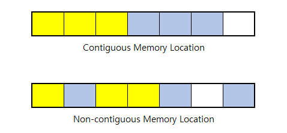

---

# 연속적 메모리 할당

## 고정 크기 할당

메모리를 동일한 크기로 자른 뒤, 각 프로세스마다 블럭 하나만 주는 방식입니다. 전체 메모리가 N분할 되었다면 적재될 수 있는 프로세스도 최대 N개이므로 `다중 프로그래밍 정도는 블럭의 개수`와 같으며, 모든 프로세스는 `할당된 메모리 크기가 서로 같습니다`. 현대에서는 사용되지 않는 방식입니다.

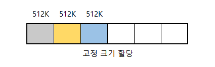

---

## 동적 크기 할당

고정 할당과 달리 각 프로세스에게 할당된 메모리 크기가 다를 수 있습니다.

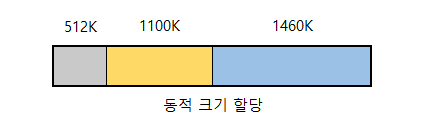

이러한 가변 할당은 고정 할당과 달리 `외부 단편화`(`External Fragmentation`)라는 문제를 발생시킬 수 있는데, 할당과 해제를 반복하다보면, 중간중간에 생기는 `제대로 사용할 수 없는 빈 공간`이 바로 그것입니다. 외부 단편화가 골칫거리인 이유는 각각의 단편화의 크기는 작을지라도, 전부 모으면 새로운 프로세스를 하나 더 적재할 수 있을만큼 커지기 때문입니다. 이것은 가변 할당의 고질적인 단점입니다.

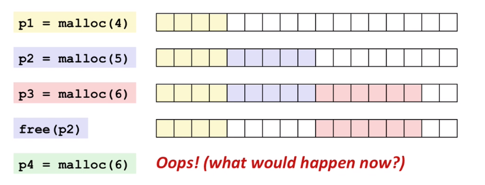

---

### 최초 적합

`최초 적합`(`First-Fit`)은 처음으로 만난 적당한 빈 공간에 프로세스를 적재합니다. 처음으로 만난 빈 공간에 바로 할당해주면 되므로, 다른 두 방식보다 시간복잡도가 낮습니다.

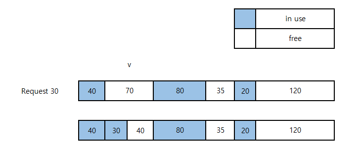

---

### 최적 적합

`최적 적합`(`Best-Fit`)은 적당한 빈 슬롯 중 가장 작은 공간에 프로세스를 적재합니다. 모든 빈 공간을 탐색해야 하므로 시간복잡도가 높으며, 매우 작은 크기의 빈공간을 생성합니다.

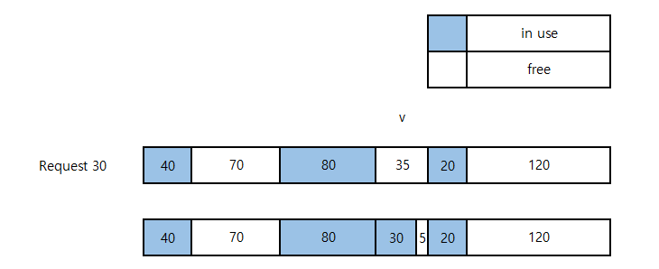

---

### 최악 적합

`최악 적합`(`Worst-Fit`)은 적당한 빈 슬롯 중 가장 큰 공간에 프로세스를 적재합니다. 모든 빈 공간을 탐색해야 하므로 시간복잡도가 높으며, 매우 큰 크기의 빈공간을 생성합니다.

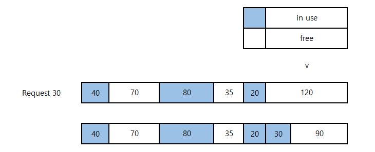

---

## 외부 단편화 해결

### 압축

할당된 메모리를 전부 몰아넣으면 단편화를 없앨 수 있으며, 이것을 `메모리 압축`(`Memory Compaction`)이라고 부릅니다. 메모리를 이동시키는 작업은 크기에 비례하여 비싸지기 때문에, 어떻게 메모리를 몰아넣을지에 따라 시간복잡도가 달라지며 `Rum-Time Binding`이 허용되지 않으면 애초에 사용할 수 없습니다.

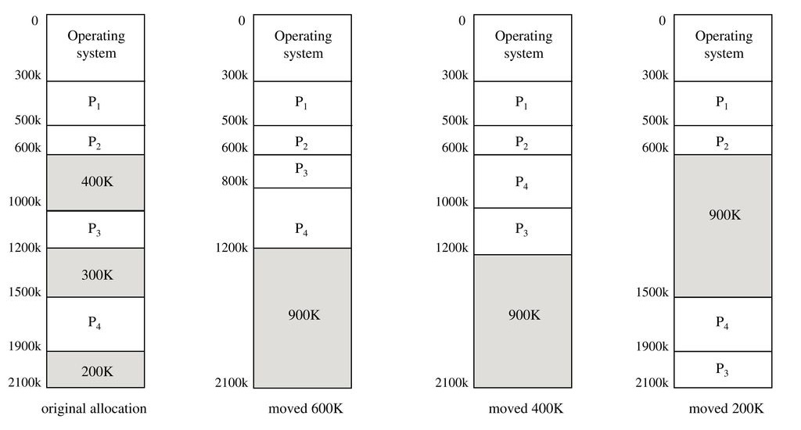

**그림 설명 :**

-   모든 프로세스를 위쪽으로 순서대로 몰아넣어야 한다면, `P3(200K)`와 `P4(400K)`를 이동시켜야 하므로 `600K`을 이동시켜 압축할 수 있음.
-   처음부터 `P4`를 `P3`의 위로 이동시키면 `400K`만 이동시켜 압축할 수 있음.
-   양쪽으로 몰아넣기가 허용된다면 `P3`를 `P4`의 아래로 이동시켜 `200K`만 이동시켜 압축할 수 있음.

---

### 비연속적 할당으로 도망가기

외부 단편화는 애초에 `연속적 할당`에서만 발생하므로, 비연속적 할당 방식인 `페이징`을 사용하여 외부 단편화를 방지할 수 있습니다.

---

# 페이징

## 프레임과 페이지

`페이징`(`Paging`)은 고정크기 할당과 비슷하지만, 나눠진 물리적 블럭을 `프레임`(`Frame`)이라고 부르며, 하나의 프로세스가 여러개의 프레임을 할당받을 수 있습니다. 이 때, 운영체제는 프로세스의 메모리 접근을 관리하기 위해 프레임을 직접적으로 사용하지 않고 `페이지`라는 논리적인 블럭을 사용합니다. 둘은 1:1로 대응되는 개념이므로 `프레임과 페이지의 단위 크기는 같아야 함`에 주의해주세요.

---

## 페이지 테이블

페이지는 `페이지 테이블`을 통해 자신이 어느 프레임을 가르키고 있는지 알아낼 수 있습니다. 예를 들어, 아래의 상황에서는 `P1의 3번째 페이지`가 `메모리의 4번째 프레임`을 가르키고 있는 것을 확인할 수 있습니다.

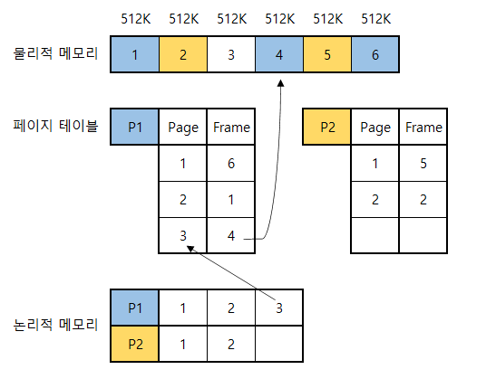

---

## 논리적 주소 변환

한 페이지에는 여러개의 데이터가 담길 수 있으므로, 어떤 데이터의 시작지점(=`주소`)를 명확하게 표현하기 위해서는 2개의 정보가 필요합니다.

-   페이지 번호
-   페이지 내에서 시작지점과의 `변위`(`offset`)

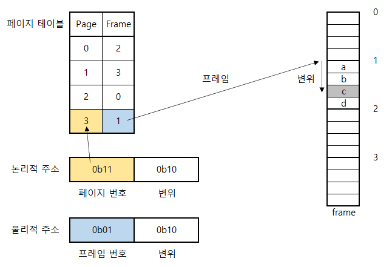

위의 예제에서 논리적주소 `1110`은 두 가지 정보를 표현합니다.

-   `페이지 번호` : 0b11 → 3
-   `페이지 변위` : 0b10 → 2

페이지 테이블을 통해 페이지를 프레임으로 바꿀 수 있으므로,

-   `프레임 번호` : 0b01 → 1
-   `프레임 변위` : 페이지 변위와 같음.

따라서 논리적주소 `0b1110`은 물리적주소 `0b0110`와 같으며, 해당 주소가 가르키는 데이터는 `0b01번째 프레임`에서 `0b10번째 위치`에 있는 `c`임을 알 수 있습니다.

이제 다음 그림의 물리적 메모리의 빈칸을 채울 수 있겠죠?

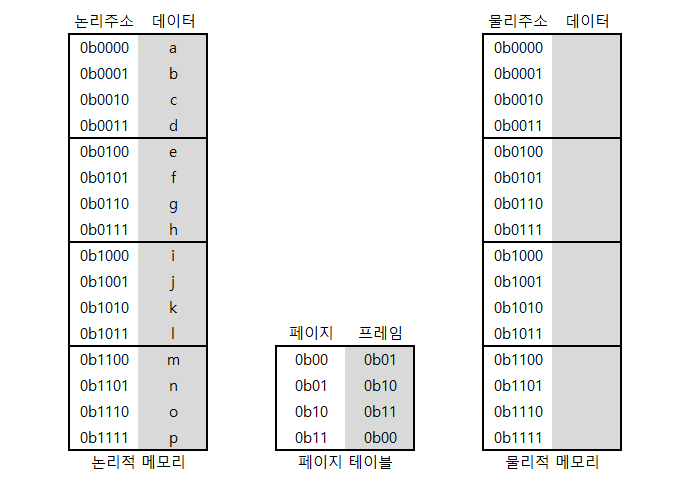

---

## 주소의 크기

램의 용량이 커지면 `표현해야 할 영역의 크기도 증가`하므로 주소를 표현하는 정보의 크기도 커질 수 밖에 없습니다. 실제로 32비트 운영체제에서는 최대 4GB만 인식할 수 있으므로 `4바이트`로도 모든 영역을 표현할 수 있지만, 64비트 운영체제에서는 `8바이트`는 되어야 인식된 메모리의 모든 영역을 표현할 수 있습니다.

메모리의 크기가 `2^m`바이트이고 페이지의 크기가 `2^p`바이트 이라면, 다음 규칙에 따라 가용가능한 최소 크기의 주소 사이즈를 산출할 수 있습니다.

-   `변위 부분의 크기` : `p` 비트
-   `번호 부분의 크기` : `m - p`비트

---

**변위 부분의 크기 :**

변위 부분은 페이지의 어느 부분이라도 가르킬 수 있어야 하므로 페이지의 크기가 `2^p`바이트라면 최소한 `p`비트가 필요합니다. 예를 들어, 페이지의 사이즈가 `4`바이트라면 최소 2개 비트는 있어야 모든 바이트를 표현할 수 있기 때문입니다.

-   `0b00` : 페이지의 0번째 바이트
-   `0b01` : 페이지의 1번째 바이트
-   `0b10` : 페이지의 2번째 바이트
-   `0b11` : 페이지의 3번째 바이트

---

**번호 부분의 크기 :**

메모리의 크기가 `2^m`바이트이고 페이지의 크기가 `2^p`바이트라면, 전체 램은 `2^m / 2^p`개의 페이지로 분할됩니다. 수식을 정리하면 `2^(m-p)`개의 페이지와 같고, 변위 부분에서와 같은 방식으로 최소 `m-p`개의 비트가 있어야 모든 페이지를 가르킬 수 있음을 알 수 있습니다.

---

## 내부 단편화

사용하지 못하는 페이지는 존재하지 않으므로 외부 단편화는 없어졌지만, 페이지를 다 쓰지 않았는데도 새로운 페이지를 요청하는 `내부 단편화`(`Internal Fragmentation`)이 발생할 수 있습니다.

-   필요한 것은 `1111KB` 밖에 안되는데, `512KB` 페이지를 3개 줘야함.
-   추가로 `4KB`를 요구했는데, 각 페이지의 가용공간이 `{3KB, 0KB, 1KB}` 밖에 없어서 새로운 페이지를 온전히 줘야함.

너무 부정적인 측면만 강조했는데, 이렇게 겁을 줘도 외부 단편화보다는 `내부 단편화가 훨씬 낫습니다`. 프로세스가 종료되면 내부 단편화는 알아서 사라지기 때문입니다.

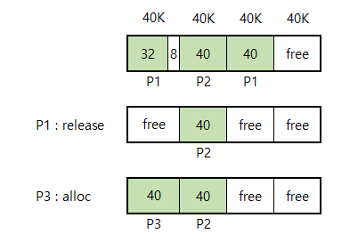

---

## 문맥교환

운영체제는 페이지 테이블을 프로세스 정보와 함께 유지하므로 `프로세스가 가지게 된 정보가 증가`한 것과 같습니다. 이것은 곧 문맥교환 비용의 증가로 이어집니다. 어떻게 하면 문맥교환을 가볍게 할 수 있을까요?

---

### PTBR를 사용한 해결안

문맥교환 비용의 증가를 막는 첫 번째 방법은 `페이지 테이블 기준 레지스터`(`Ptage-Table Base Register`)를 사용하는것 입니다. 운영체제는 페이지 테이블을 메인 메모리에 전부 올려놓고, 현재 작업에 연관된 페이지 테이블을 가르키도록 `PTBR 레지스터`의 값을 지정하는것 입니다. 문맥교환이 발생하면 레지스터의 값만 바꾸어 해결할 수 있습니다.

그러나 이 방식은 논리적 주소를 통해 데이터를 읽으려 할 때 `2번의 액세스가 발생`하므로 비효율적입니다. CPU는 1클럭 연산인데 반해서 RAM은 매우 느리다는 것을 생각해보면 2번의 RAM 액세스가 얼마나 치명적인지 알 수 있습니다.

-   메인 메모리에 저장된 테이블 페이지에 액세스하기 위해 한번.
-   변환된 물리적 주소로 메인 메모리에서 값을 가져오기 위해 한번.

---

### TLB를 같이 사용한 해결안

`PTBR` 혼자서는 매우 느리므로, 현대 시스템은 `Transaction Look-aside Buffer`라는 매우 빠르고, 매우 비싸고, 매우 작은 딕셔너리 캐시(`연관 캐시`)를 동시에 사용합니다. 주어진 페이지 번호에 연관된 프레임의 번호를 얻어와야 할 때, 먼저 이 캐시를 들여다보고 없는 경우에만 `PTBR`을 통해 가져오는 것이죠.

다음 챕터에서 나오는 내용이지만 `프로세스의 지역성`에 의해 프로세스는 모든 페이지를 골고루 액세스하지 않으므로, 자주 사용되는 페이지를 캐싱해두면 전체적인 성능향상을 기대할 수 있습니다

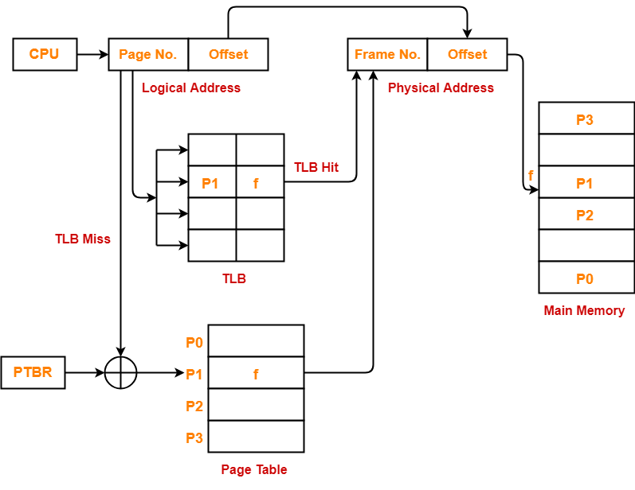

단, 문맥교환이 발생하면 페이지 번호에 연관된 프레임 번호가 바뀌게 되므로, 잘못된 프레임 번호를 반환하지 않도록 캐시를 초기화해야 합니다.

---

## 공유 페이지

여러 프로세스가 동일한 라이브러리를 사용한다면, 해당 라이브러리에 연관된 페이지를 다수의 프로세스에게 공유시켜 메모리를 절약할 수 있습니다.

---

## 보호 비트

페이지 테이블에는 `프레임 번호`와 함께 올바른 접근인지 확인하기 위해 2가지 플래그를 함께 저장합니다.

-   `유효/무효 비트`
-   `읽기/쓰기 비트`

유효-무효 비트를 통해 해당 페이지가 그 프로세스에게 소유되었는지를 검사하며, 읽기-쓰기 비트를 통해 읽기전용 페이지에 쓰기를 시도하려는 것인지를 검사합니다. 이 두 개의 검사를 통과하지 못한다면 운영체제가 `트랩`을 발생시킵니다.

---

## 페이지 테이블 구조

### N단계 계층적 페이지 테이블

N차원 배열이 존재하듯이 `페이지의 하위요소가 페이지`인 경우도 있을 수 있습니다. 이렇게 하나의 테이블의 엔트리가 하위 페이지중 하나를 가르키는 방식을 `N단계 계층적 페이지`(`Multi-Level Hierarchical Page`)라고 부릅니다.

페이지의 단계가 깊어질수록 페이지의 크기는 점점 작아지기 때문에, 이 방식을 적용하면 작은 메모리 요구를 `내부 단편화를 최소화 하면서` 들어줄 수 있습니다. 1바이트만 요청하더라도, 계층적 단계를 높이면 충분히 작은 크기의 페이지를 내어줄 수 있습니다.

각 단계별 페이지의 수가 균일해지고 최종 단계의 페이지 크기가 작아질수록 성능이 좋아지지만, 페이지 레벨이 높아질 때 마다 `물리적 주소 변환 비용이 더 빠르게 증가`하므로 64비트 환경처럼 무수히 많은 계층으로 나눠야 하는 상황에서는 부적절합니다. 32비트 시스템에서는 매우 유용하게 사용된 방식입니다.

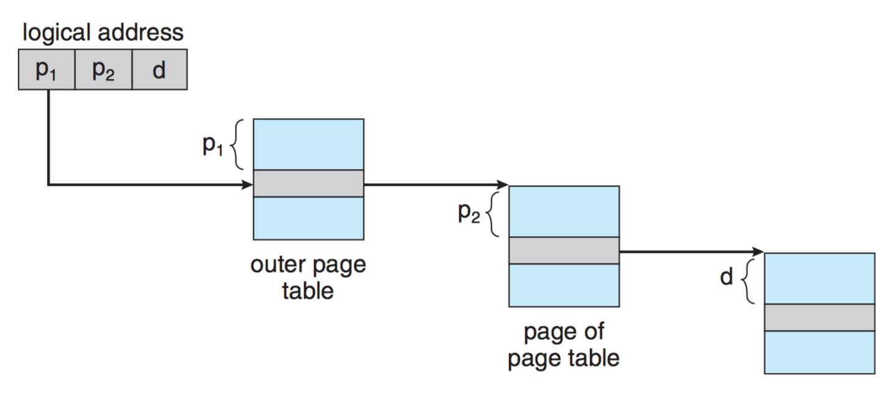

---

### 해쉬된 페이지 테이블

해시는 넓은 도메인에서 값을 찾는데에 특화되어 있으므로, 이것을 페이지 테이블에 적용하면 64비트 환경에서도 빠르게 물리적 주소를 찾을 수 있습니다. 이것을 `해쉬된 페이지`(`Hashed Page`)라고 합니다.

해시된 페이지는 `해싱된 논리적 주소`를 사용하여 물리적 주소를 얻는데, 구체적으로는 해싱값에 연관된 연결 리스트로 이동하여 `논리적 주소와 일치하는 노드`를 순차적으로 탐색하여 `일치한 노드의 값`을 가져와 물리적 주소로 사용합니다.

이 방식은 해시의 특징을 이어받았기에, 메모리 영역이 방대하고 불연속적으로 할당되는 경우에 유리합니다. 64비트인 현대적 환경에 매우 적합한 기법입니다.

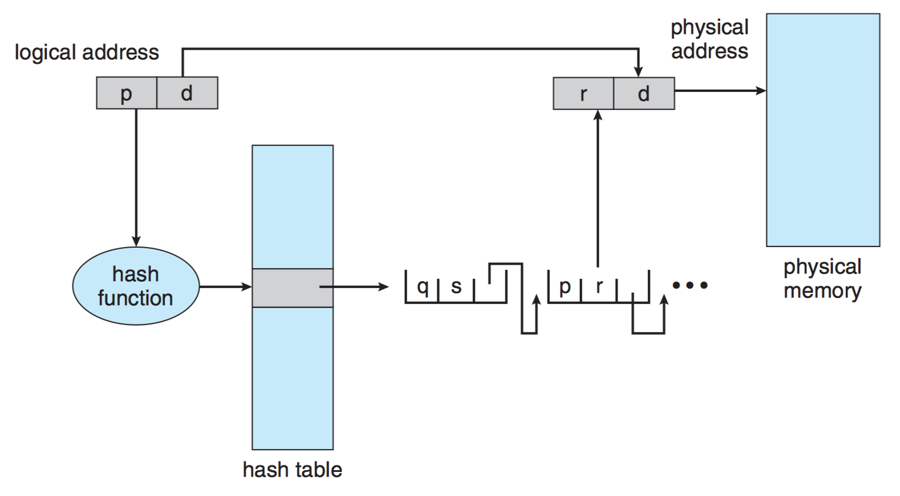

위의 그림은 다음과 같은 순서로 동작합니다.

1. 논리적 번호 `p`의 해싱값을 사용하여 연결 리스트에 접근한다.
2. 연결 리스트의 첫 번째 노드는 `{논리=q, 물리=s}`이므로 찾는 노드가 아니다.
3. 연결 리스트의 두 번째 노드는 `{논리=p, 물리=r}`이므로 찾고있던 노드다!
4. 그러므로, 페이지 번호 `p`는 프레임 번호 `r`로 사상된다.

---

### 역 페이지 테이블

보통 페이지 테이블은 프로세스가 자신의 정보로써 관리(`소유`)하지만, 새 페이지를 할당받아야 하는 것 처럼 `프레임의 사용정보`를 추척해야 하는 경우 비용이 비싸집니다. 자신이 가지고 있는 페이지 테이블에는 `가용할 수 있는 프레임 정보`가 포함되어 있지 않으므로, 운영체제에게 부탁해야 하기 때문입니다. 또한 각 프로세스마다 테이블을 생성해야 하기 때문에 메모리를 많이 사용해야 합니다.

일부 운영체제는 이 문제를 `프로세스는 페이지 테이블을 가지지 않고`, `운영체제는 프레임(Frame) 테이블을 관리`하는 것으로 해결하는데, 이러한 설계를 `역 페이지 테이블`(`Inverted Page Table`)라고 부릅니다. 페이지 테이블이 아닌 `프레임 테이블`이라고 말한 것에 유의해야 합니다. 이러한 설계를 도입한 운영체제는 다음과 같이 2개 항목으로 구성된 테이블을 유지합니다.

-   프레임을 소유한 작업의 식별자 (`pid`)
-   논리적 번호

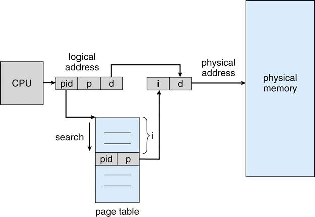

위의 그림을 설명하면 다음과 같습니다.

1. `작업 식별자(pid)`, `논리적 주소(p)`, `변위(d)`로 구성된 논리주소가 호출된다.
2. 운영체제는 테이블을 순차적으로 탐색하며 `{pid, p}`에 매칭되는 노드의 인덱스(`i`)를 찾는다.
3. 논리적 주소의 `{pid, p}`는 노드의 인덱스 `{i}`로 사상된다.

---

이러한 설계는 운영체제에 페이지 테이블이 1개만 존재하므로 `용량이 절약`되지만, 주소변환을 하기 위해 `매번 순차적 반복을 해야 한다는 것`과 하나의 프레임에 2개 이상의 pid를 설정할 수 없으므로 공유 페이지와 같은 `메모리 공유 기법이 불가능`하다는 단점이 있습니다.

---

# 세그먼테이션

## 필요성

프로그램은 단순한 비트의 조합이 아닙니다. 프로그램을 아주 살짝만 더 들여다 보면 다음과 같이 구성되어 있습니다.

-   프로그래머가 작성한 명령어
-   전역에서 사용하는 공유 데이터
-   작성된 프로그래밍 언어에서 제공하는 표준 라이브러리

---

페이징은 이러한 프로그램 구성요소들의 특징을 중요하게 생각하지 않으므로, `함수의 코드가 서로다른 페이지로 분리`되는 불상사가 일어날 수 있습니다. 즉, 함수를 실행하려면 그 함수를 구성하고 있는 모든 페이지를 적재해야 합니다.

당연한 것 같다구요? 아래의 그림을 살펴보면, 한 번의 페이지 적재로 끝낼만한 데이터가 두 번에 나뉘어서 적재되는 상황을 나타내고 있습니다. 페이지를 적재하는 것은 꽤나 비싼 작업이므로, 굳이 여러개의 페이지를 적재해야 하는 것은 매우 비효율적입니다.

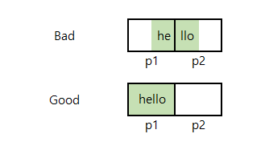

---

세그먼테이션은 위에서 설명했던 `사용자 측면의 데이터 관리`를 할 수 있도록 도와주는 `연속 할당 기법`입니다. 동일한 특징을 갖는 데이터를 하나의 세그먼트에 저장시켜, 비슷한 성질의 데이터 밀집도를 향상시킵니다. 예를 들어, `C++` 프로그램이 메모리에 올려질 때는, 다음과 같이 비슷한 성질의 데이터가 같은 세그먼트에 모여있게끔 적재됩니다.

-   `Test Segment` : 실행가능한 코드 영역
-   `Initialized Data Segment` : 초기화된 전역 변수 영역
-   `Uninitialized Data Segment` : 초기화되지 않은 전역 변수 영역
-   `Heap Segment` : 동적 할당 변수가 저장될 영역
-   `Stack Segment` : 지역 변수가 저장될 영역

---

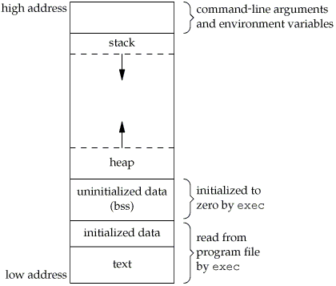

---

## 세그먼트 테이블

페이지와 마찬가지로 프로세스는 세그먼트 테이블을 유지합니다. 각 세그먼트는 다음과 같은 정보로 구성됩니다.

-   `BASE` : 세그먼트의 시작지점
-   `LIMIT` : 세그먼트의 크기
-   `Rread/Write Flag` : 읽기전용 여부

---

## 세그먼트 보호

세그먼트는 페이지와 비슷한 측면이 많습니다. 데이터를 요청할 때에는 `{세그먼트 번호, 변위}`의 조합을 사용하고, 다음과 같은 올바르지 못한 요청을 받으면 `트랩`을 발생시킵니다.

-   읽기 전용 세그먼트에 쓰기.
-   세그먼트 크기를 넘어서는 변위.
-   자신의 것이 아닌 세그먼트에 접근.

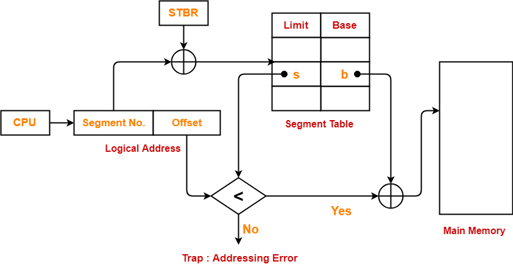

---

## 단점

세그먼테이션은 연속 할당 기법이므로 `외부 단편화`가 발생하며, 데이터를 얻어올 때에도 `2번의 액세스가 필요`합니다.

-   세그먼테이션 테이블에 액세스.
-   변환된 물리적 주소로 실제 데이터에 액세스.

---

## 페이징된 세그먼테이션

`페이징`과 `세그먼테이션`을 동시에 사용할 수 있습니다.

---

**장점 :**

-   외부 단편화 제로. (페이징의 성질)
-   동일한 성질의 데이터가 서로다른 페이지에 저장될 확률이 낮아짐. (세그먼테이션의 성질)

---

**단점 :**

-   너무 길어지는 논리적 주소 (`{세그먼트번호, 페이지번호, 변위}`)
-   데이터를 얻어오려면 3번은 액세스 해야함. (`TLB`가 히트해도 2번.)
    1. 세그먼테이션 테이블 액세스
    2. 페이지 테이블 액세스 (TLB 캐싱으로 생략될 수 있음)
    3. 변환된 물리주소로 실제 데이터에 액세스

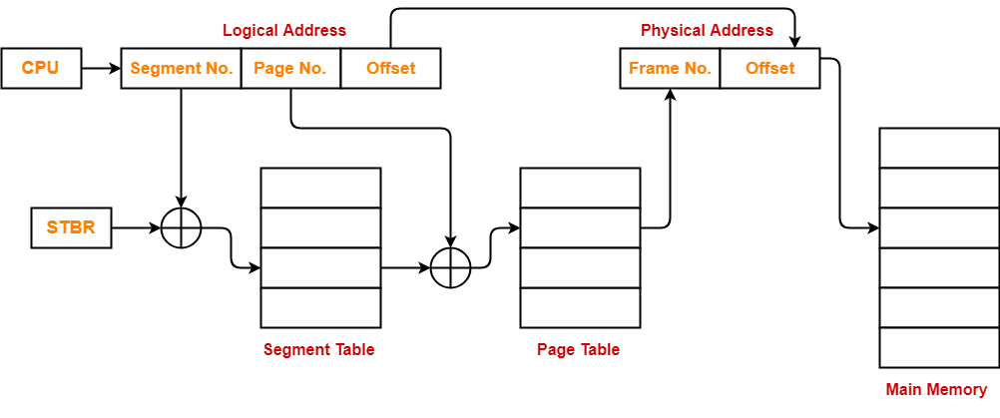
