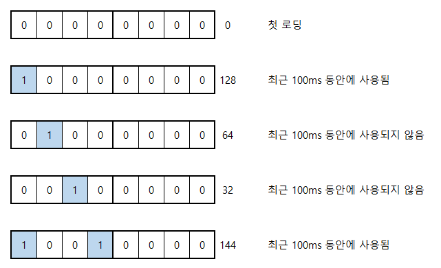

# 논리적 메모리

## 개요

프로그램이 실행되기 위해서는 먼저 메모리에 적재되어야 했습니다. 가장 간단한 방법은 `프로그램 전체를 메모리에 적재`하는 것이지만, 프로그램의 크기가 물리 메모리보다 큰 경우에는 어떻게 메모리에 적재되어야 할까요?

---

## 가상 메모리

이러한 문제를 해결하기 위해 `전체 중에서 사용할 부분만 적재`하는 방식이 탄생했습니다. 프로그램이 필요한 전체 메모리를 `논리적(가상적) 메모리`로 바라보고, 이 중에서 현재 실행에 필요한 부분만 `물리적 메모리`에 옮겨다 놓는 식이죠.


이 방식을 사용하면 다음과 같은 장점을 얻을 수 있습니다.

-   메모리를 프로그램의 관점(`논리적 관점`)과 램의 관점(`물리적 관점`)으로 분리할 수 있다.
-   메인 메모리보다 큰 프로그램을 실행할 수 있다.
-   절대 실행되지 않는 코드는 적재되지 않는다.
-   각 프로세스에서 필요한 데이터만 적재하므로, 메모리 용량을 절약할 수 있다.
-   더욱 많은 프로세스를 적재할 수 있으므로 `다중 프로그래밍 정도`, `CPU 사용률`, `처리량`도 높아진다.
-   프로세스의 용량이 가벼워지므로 `swapping`과 `fork()`의 성능도 향상된다.


---

# 페이지 부재

## 요구 페이징

위의 개념을 도입하면 `프로세스가 적재되지 않은 페이지를 요구하는 경우`가 생길 수 있습니다. 이것을 `페이지 부재`(`Page-Fault`)라고 하며, 해당 페이지를 적재시키도록 운영체제에게 요구하는 것을 `요구 페이징`(`Demand Paging`)이라고 합니다.

요구 페이징이 발생하면 디스크 작업으로 인해 프로세스가 잠깐 정지되는데, 다행히도 곧 설명할 `프로세스의 지역 참조성` 덕분에 요구 페이징은 자주 발생하지 않습니다. 그러나, 요구 페이징은 매우 비싼 작업임을 잊지 말아주세요.


**진행 과정 :**

1. 요구한 페이지의 `유효비트를 검사`한다.
2. 무효의 이유가 페이지 부재라면 `페이지 부재 트랩`을 발생시킨다.
3. 디스크에서 해당 페이지를 찾는다. `디스크 I/O는 CPU를 사용하지 않는 작업`이므로 CPU를 양보하기 위해 프로세스를 `Waiting`상태로 바꾼다.
4. `빈 프레임`(`Free Frame`)을 찾고 페이지를 할당한다.
5. 페이지 테이블의 무효비트를 `유효(v)`로 바꾸고 `로딩 완료 인터럽트`를 보낸다.
6. 로딩 완료 인터럽트를 수신하면 프로세스가 CPU 기회를 얻을 수 있도록 `Ready`상태로 바꾼다. 나중에 스케쥴러에 의해 CPU가 할당되었다면 멈춰진 인스트럭션부터 재개된다.

---

## 요구 페이징 종류

-   `일반 요구 페이징` : 필요해질 것 같은 페이지도 미리 예측하여 적재.
-   `순수 요구 페이징` : 지금 필요한 것만 적재.

예를 들어, 다음과 같은 프로그램을 생각해봅시다.

```cpp
int main(){
    // page 1
    cout << "In Page-1";

    // page 2
    cout << "In Page-2";

    // page 3
    cout << "In Page-3";
}
```

일반 요구 페이징은 위 프로그램이 적재되면, 아직 `cout`을 만나지 않았음에도 `Page 1`, `Page 2`, `Page 3`을 미리 적재합니다. 곧 실행될 가능성이 매우 높기 때문이죠. 반면에 순수 요구 페이징은 어떠한 페이지도 미리 올려놓지 않으므로, 매 `cout`을 만날 때 마다 페이지 부재가 발생하게 됩니다.

즉, 순수 요구 페이징은 첫 실행부터 페이지 부재가 발생합니다.

---

# 페이지 교체

## 페이지가 부족한 경우의 전략

새로운 페이지를 적재하기 위한 `Free Frame`이 부족한 경우, 빈 프레임을 확보하기 위해 다음과 같은 전략을 선택할 수 있습니다.

1. 다른 프로세스를 종료
2. 다른 프로세스를 일시정지하고 백업 (스왑 아웃)
3. 해당 프로세스가 사용하고 있던 페이지를 교체

---

첫 번째 전략은 희생될 프로세스의 연산결과가 사라지므로 논외입니다. 시스템의 시간당 처리량이 낮아지기 때문에, 시스템의 성능을 효율적으로 이끌어 낼 수 없기 때문입니다.

두 번째 전략은 다중 프로그래밍 정도(`동시에 적재할 수 있는 프로세스의 수`)가 매우 높을 때 최적입니다. 프레임의 개수는 한정되어 있는데, 너무 많은 프로세스들가 적재되어 있다면, 어느 프로세스도 프레임이 부족하다고 비명을 지를 것 입니다. 이것을 `과할당`(`Over-Allocating`)이라고 하며, 이 경우에는 일부 프로세스를 스왑-아웃 했다가 여유가 생겼을 때 스왑-인 하는 것이 최적입니다.

또는 세 번째 전략처럼 `자주 사용하지 않는 페이지를 해제`하여 빈 프레임을 확보할 수 있습니다. 가장 일반적인 방법이므로, 이 장에서는 세 번째 전략에 대해 중점적으로 설명합니다.

가장 일반적인 방법이지만, 과할당이 발생한 경우에서 사용하면, 다음 시나리오처럼 오히려 시스템의 처리량을 감소시킬 수 있습니다.

1. 과할당으로 인해 프로세스당 프레임 수가 매우 적음.
2. 자주 사용하는 페이지의 개수가, 프레임의 수 보다 많아짐.
3. 새 페이지를 얻어야 할 때, 자주 사용되는 페이지가 희생됨.
4. 희생된 자주 사용하는 페이지를 적재하기 위해, 곧 요구 페이징이 다시 발생함.

---

## 페이지 교체 과정

### 기본적인 페이지 교체


1. 희생된 프레임의 변경점을 저장하기 위해 디스크에 쓴다.
2. 페이지 테이블에서 엔트리를 `무효(i)`로 변경한다.
3. 새 페이지를 읽어 희생된 프레임에 적는다.
4. 페이지를 불러오면 엔트리를 `유효(v)`로 변경한다.

---

### 개선된 페이지 교체

페이지 교체가 일어날 때 마다, 디스크 연산이 2번이나 발생한다는 것은 비효율적입니다. 디스크 연산이 발생 할 때 마다, 프로세스가 `Waiting`상태로 변화하기 때문입니다.

1. 디스크에 희생된 프레임의 변경점을 적기 위해 한번. (쓰기 연산)
2. 디스크에서 새로운 페이지를 읽기 위해 한번. (읽기 연산)

---

새로운 페이지를 읽는 것은 어쩔 수 없다지만, 희생된 프레임의 변경점을 적기 위한 로직은 개선의 여지가 있을 것 같습니다. `변경된 적이 없는 프레임`은 굳이 디스크에 적지 않아도 되겠죠?

이러한 아이디어에서, 현대 운영체제는 어떤 프레임이 변경점이 발생했는지 추적하기 위해, 페이지 테이블에 `변경 비트`(`Modify-Bit` 또는 `Dirty-Bit`)라는 항목을 추가했습니다. 위의 특성을 이용하여, 다음 조건 중 하나라도 만족하면 디스크 쓰기를 생략하여, 디스크 연산을 1번으로 줄일 수 있습니다.

-   변경 비트가 설정되어 있지 않은 페이지.
-   읽기 전용 페이지.

---

# 페이지 교체 알고리즘

## 개요

### 목적

자주 사용되는 페이지가 희생되지 않도록 해야합니다. 정확히는 `가까운 미래에 자주 사용되는 페이지`가 살아남도록 선택해야 합니다. 지금까지는 자주 사용되었어도, 앞으로 사용되지 않거나 매우 먼 미래에서야 다시 사용되는 페이지는 필요없기 때문입니다.

---

### 평가 지표

**페이지 부재율 :**

효율적인 알고리즘은 자주 사용될 페이지를 오래 살아남기므로 페이지 부재율이 낮습니다. 낮은 페이지 부재율은 `요구 페이징`이 적게 발생하므로 시스템 처리량이 높아집니다.

---

**벨레이디의 모순 :**

프레임을 더 줬는데 오히려 페이지 부재율이 증가하는 현상입니다. 즉, 프레임 개수에 의해 자주 사용될 프레임이 제거 될 가능성이 있다면 `벨레이디의 모순이 있다`고 표현합니다. 효율적인 알고리즘은 벨레이디의 모순을 일으키지 않습니다.

요렇게 벨레이디의 모순이 없는 알고리즘을 `스택 알고리즘`이라고하며, 사전적인 정의는 `N개의 프레임`을 사용했을 때 적재되는 페이지 집합이, `N+1개의 프레임`을 사용했을 때의 페이지 집합에도 포함되는 알고리즘입니다.

---

## 계산 시 주의사항

대부분의 페이지 부재율 계산 문제는 `순수 요구 페이징`을 기반으로 합니다. 즉, 첫 페이지 로드시에 전부 페이지 부재가 발생함에 유의해주세요.

---

## FIFO 페이지 교체

### 개념

`가장 오래된 페이지를 희생`하는 알고리즘이며, 페이지의 시간정보를 유지하기 위해 큐 또는 테이블을 만들어 관리합니다. 벨레이디의 모순을 일으키는 대표적인 알고리즘입니다.

---

### 계산

※ FIFO의 특성을 잘 드러내기 위해, 프레임 내부를 큐의 형태로 표시했습니다.


-   `페이지 히트율` : `30%` (20번 중에 6번 히트)
-   `페이지 부재율` : `70%` (20번 중에 14번 발생)

---

### 벨레이디의 모순

※ FIFO의 특성을 잘 드러내기 위해, 프레임 내부를 큐의 형태로 표시했습니다.


마지막에 남있는 요소들에 주목해주세요. 벨레이디의 모순이 없으려면, 프레임 3개의 결과집합인 `{1, 2, 5}`가 프레임 4개인 경우에도 포함되어 있어야 합니다.

---

### 문제점

-   가장 오래된 페이지가, 근미래에 가장 적게 사용될 페이지는 아님.
-   벨레이디의 모순 때문에, 프레임을 많이 줘도 성능향상을 보장할 수 없음.

---

## Optimal 페이지 교체

### 개념

`최적 페이지 교체`는 대표적인 스택 알고리즘의 일종이며 `미래를 내다보고` 남아있는 페이지 중에서 가장 오랫동안 사용되지 않을 페이지를 희생시킵니다. 영영 사용되지 않는 페이지가 여러개라면 그 중 아무거나 선택합니다. 여기서는 처음으로 발견한 페이지를 선택합니다.

---

### 계산

※ 윗 첨자는 해당 요소가 다시 사용되는 요청의 번호를 가르킵니다. 예를 들어, 1번 요청의 결과인 `1^5`는 1번 페이지가 5번째에서 다시 요청된다는 것을 가르킵니다. 윗첨자 `N`은 영영 사용되지 않을 요소임을 가르킵니다.


-   06번 요청 : `1^8`, `2^7`, `3^13`에서 가장 늦게 사용되는 3을 희생합니다.
-   18번 요청 : `2^N`, `1^N`이 있지만 가장 먼저 발견된 2를 희생합니다.
-   `페이지 히트율` : `55%` (20번 중에 11번 히트)
-   `페이지 부재율` : `45%` (20번 중에 9번 발생)

---

### 문제점

-   현실적으로 불가능.
-   왜? 페이지 요청정보를 전부 알고있을때만 작동하기 때문에.
-   여러분은 프로세스가 미래에 무엇을 요청할지 전부 알고 있나요?

---

따라서 최적 페이지 교체는 다른 알고리즘과 비교하기 위한 일종의 `대조군`으로써 활용됩니다.

---

## LRU 페이지 교체

### 개념

최적 페이지 교체는 현실적으로 불가능하다면 `그것에 근접한 알고리즘`은 어떨까요? 미래를 아는 것은 불가능하지만, 분명 프로세스가 불러오는 페이지에는 패턴이 있을 것입니다. 즉, `지금까지의 요청을 토대로 미래를 예측`하면 된다는 것이죠.

이러한 개념에서 `가장 오랫동안 사용되지 않은 페이지`를 희생하는 `Least-Recently-Used` 알고리즘이 대두되었습니다. 지금까지 오랫동안 사용되지 않은 페이지는 가까운 미래에도 사용되지 않을 것이란 생각이죠. 프레임을 준 만큼 성능이 향상되는 `스택 알고리즘`의 일종입니다.

---

### LRU 리스트

각각의 페이지가 언제 사용되었는지를 추적하기 위해 `LRU List`라는 링크드 리스트 구조를 사용할 수 있습니다. 이 리스트의 양쪽 끝은 `가장 오랫동안 호출되지 않은 것` 또는 `가장 최근에 호출된 것`을 가르킵니다. 중간에 재사용된 페이지는 `MRU End`쪽으로 이동됩니다.

**용어 설명:**

-   `Most-Recently-Used End` : 가장 최근에 사용된 것.
-   `Least-Recently-Used End` : 가장 오랫동안 사용되지 않은 것.


---

### 계산

※ LRU의 특성을 잘 드러내기 위해, 프레임 내부를 LRU List의 형태로 표시했습니다. 맨 윗부분이 MRU-End이고, 맨 아랫부분이 LRU-End입니다.


-   `페이지 히트율` : `45%` (20번 중에 9번 히트)
-   `페이지 부재율` : `55%` (20번 중에 11번 발생)

---

### 문제점

-   페이지가 요청될 때 마다 `LRU List`를 갱신해야 됨.
-   페이지 요청 수가 어마어마할텐데, 그 때 마다 갱신?...
-   이런 어마어마한 오버헤드를 감당할 수 있는 시스템은 거의 없음.


---

## LRU 근사 페이지 교체

### 개념

`LRU`와 비슷하지만 현실적으로 가능한 알고리즘을 생각해야 합니다. 최근에 사용된 적이 있는지 추적하기 위해 `참조 비트`를 추가하면 LRU와 상당히 근사한 알고리즘 (`LRU Approximation Algolithm`)을 구현할 수 있습니다. 방금 적재된 페이지의 참조비트는 0이며, 이후에 참조되면 1로 변경됩니다.

---

### 부가적 참조 비트 페이지 교체

부가적 참조 비트(`Additional-Reference Bits`) 알고리즘은, 각 페이지에 N크기의 참조비트를 사용하여 선후관계를 비교합니다.

---

**참조비트 타이머 :**

1. 100ms 주기로 동작하는 타이머를 달아둔다.
2. 타이머 인트럽트가 발생하면 모든 페이지의 참조비트를 오른쪽으로 1칸 시프트한다.
3. 최근 100ms 동안 참조된 적이 있는 페이지는 맨 좌측비트를 1로 설정한다.
4. 타이머를 초기화한다.

---

**희생 페이지 선택:**

1. 참조비트를 양수로 해석하여 가장 낮은 값을 갖는 페이지를 희생시킨다.
2. 그러한 페이지가 여러개라면, 부가적인 알고리즘으로 결정한다.

---

아래는 어떤 페이지 하나의 참조비트가 변경되는 과정을 나타냅니다. 타이머의 주기는 100ms이고, 참조비트 배열의 크기는 8비트입니다.



가장 첫 `1`이 왼쪽에 있을수록 최근에 사용된 것이므로, 양수로 해석한 결과가 클수록 최근에 사용된 페이지임을 알 수 있습니다. `타이머의 주기`와 각 페이지에 할당된 `참조비트 배열의 크기`는 운영체제마다 다를 수 있습니다.

---

### 개선된 2차 기회 페이지 교체

이 알고리즘은 참조비트를 1개만 유지합니다. 기본적으로는 `FIFO`처럼 동작하지만 참조비트가 1인 경우, 참조비트를 0으로 고치고 맨 끝으로 되돌립니다(=한번 더 기회를 줍니다). 참조비트가 0이라면 해당 페이지를 희생시킵니다. 참조비트가 항상 1로 설정될 만큼 자주 사용하는 페이지는 희생되지 않습니다.

---

※ 윗 첨자는 참조비트를 의미합니다.


-   `페이지 히트율` : `45%` (20번 중에 9번 히트)
-   `페이지 부재율` : `55%` (20번 중에 11번 발생)

---

5번에서 6번으로 넘어갈 때, 내부적으로 다음과 같이 수행됩니다.


1. 마지막 페이지인 1의 참조비트가 1이므로 기회를 한번 더 준다.
2. 마지막 페이지인 2의 참조비트가 1이므로 기회를 한번 더 준다.
3. 마지막 페이지인 3의 참조비트가 0이므로 해당 페이지를 희생한다.
4. 새로운 페이지인 5를 적재한다.
5. 페이지 2의 참조비트를 1로 수정한다.
