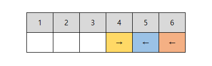

# 개요

보자마자 팟 하고 떠오르지 않으면 매우 고생하는 문제입니다. 어느 문제나 그렇겠지만, 이러한 `애드 혹` 분류의 문제는 이런 경향이 더 심합니다. 핵심은 `개미간 충돌을 고려하지 않는다`입니다.

---

# 해설

## 충돌 무시하기

아래와 같이 충돌 직전의 두 개미를 생각해보겠습니다.


---

1초 뒤에 두 개미는 서로 충돌하여 개미의 진행방향이 다음과 같이 바뀔 것입니다.


---

여기서 개미가 아닌 `화살표`에 집중해볼까요? 화살표만 바라보았을 때, `→ 화살표`는 `← 화살표`가 있든 없든 상관없습니다. 항상 4에서 5로 이동함을 알 수 있습니다.


---

마찬가지로 `← 화살표`도 `→ 화살표`가 있든 없든 상관없이, 항상 5에서 4로 이동함을 확인할 수 있습니다.


---

위의 이유로, 각 화살표는 `다른 화살표를 신경쓰지 않고 제 갈길만 가면 된다`는 결론에 도달합니다.


---

개미가 여러마리 있어도 상관없습니다.


---

위 그림에서 `position = 5`에서 양쪽 화살표가 겹쳐진 상황은, 0.5초 단위로 생각해보면 쉽게 이해할 수 있습니다.

-   0.0초 경과 : `4.0 →` `← 5.0` `← 6.0`
-   0.5초 경과 : `4.5 →` `← 4.5` `← 5.5` (4.5에서 충돌)
-   1.0초 경과 : `← 4.0` `5.0 →` `← 5.0` (5.0에서 충돌)
-   1.5초 경과 : `← 3.5` `← 4.5` `5.5 →`
-   2.0초 경과 : `← 3.0` `← 5.0` `6.0 →`

---

## 화살표의 추락방향, 추락시간 계산

위의 성질을 이용하면 `왼쪽으로 떨어질 개미의 수`와 `오른쪽으로 떨어질 개미의 수`를 쉽게 구할 수 있습니다. `← 화살표`는 왼쪽으로 떨어지겠고, `→ 화살표`는 오른쪽으로 떨어지겠죠.



**각 끝의 추락 수 :**

-   `좌측으로 떨어질 개미의 수` : 2마리 (5번 화살표, 6번 화살표)
-   `우측으로 떨어질 개미의 수` : 1마리 (4번 화살표)

---

각 화살표의 추락시간도 구할 수 있습니다.

---

**각 화살표의 추락:**

-   `4번 화살표` : 3초 뒤에 7에서 추락
-   `5번 화살표` : 5초 뒤에 0에서 추락
-   `6번 화살표` : 6초 뒤에 0에서 추락

---

## 화살표에 개미번호 매칭시키기

아래 그림에서 `5번 화살표`가 5초뒤에 0에서 추락하는 것은 사실이지만, `5번 위치에 있던 개미`가 5초 뒤에 0에서 추락하는 것은 아닙니다. 튕겨나가서 2초 뒤에 7에서 떨어지겠죠. 즉, 화살표는 개미 번호와 아무 관련이 없습니다.


모든 튕겨짐을 계산하면 시간초과가 뻔하겠죠? 여기서 직관이 필요한데, `왼쪽에 가까운 개미들이, 왼쪽 화살표의 개수만큼, 왼쪽으로 떨어진다`는 것입니다.

---

예를 들어, 다음 그림에서 `왼쪽 화살표의 개수 1만큼` 왼쪽에 가까운 개미들이 왼쪽으로 떨어집니다.


---

예를 들어, 다음 그림에서 `왼쪽 화살표의 개수 2만큼` 왼쪽에 가까운 개미들이 왼쪽으로 떨어집니다.


---

예를 들어, 다음 그림에서 `왼쪽 화살표의 개수 3만큼` 왼쪽에 가까운 개미들이 왼쪽으로 떨어집니다.


---

예를 들어, 다음 그림에서 `왼쪽 화살표의 개수 0만큼` 왼쪽에 가까운 개미들이 왼쪽으로 떨어집니다. 왼쪽으로 떨어지는 개미가 없다는 뜻이죠?


---

이것은 `오른쪽 화살표`에도 동일하게 적용되므로, 정리하면 다음과 같습니다.


---

양끝에 가까이 있을수록 빨리 떨어지겠죠? 먼저 구해놨던 `왼쪽 화살표의 추락시간`을 오름차순으로 정렬하면, 왼쪽에서 n번째 개미가 언제 추락하는지 구할 수 있습니다. 따라서, 왼쪽으로 떨어질 개미 중에서 가장 우측에 있는 개미가 `왼쪽으로 가장 늦게` 떨어집니다.


---

마찬가지로 오른쪽으로 떨어질 개미 중, 가장 좌측에 있는 개미가 `오른쪽으로 가장 늦게` 떨어집니다.


---

## 결과 도출하기

처음부터 정답 후보는 2개밖에 없었습니다. 둘을 비교해서, 더 늦게 떨어지는 개미를 고르면 됩니다.


-   좌측으로 가장 늦게 떨어질 개미 (개미번호 : `왼쪽구간의 길이 + 0`)
-   우측으로 가장 늦게 떨어질 개미 (개미번호 : `왼쪽구간의 길이 + 1`)

---

# 추가 테스트케이스

## 1번

**input :**

```text
1 6
2
```

**expect:**

```text
1 4
```

---

## 2번

**input :**

```text
1 6
-2
```

**expect:**

```text
1 2
```

---

## 3번

**input :**

```text
2 5
4
-3
```

**expect:**

```text
2 3
```

---

## 4번

**input :**

```text
2 10
8
-9
```

**expect:**

```text
1 9
```

---

## 5번

**input :**

```text
3 10
1
2
-3
```

**expect:**

```text
2 9
```

---

## 6번

**input :**

```text
4 10
1
2
-3
-4
```

**expect:**

```text
3 9
```
