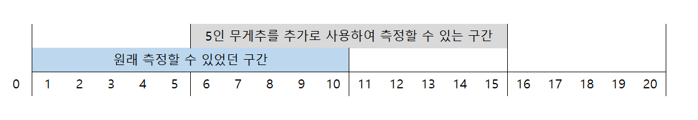
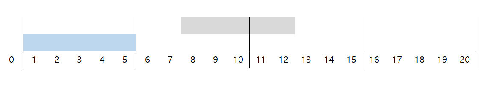
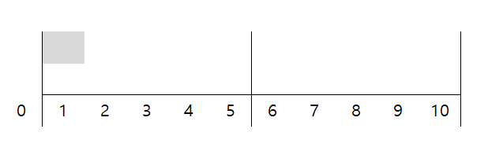
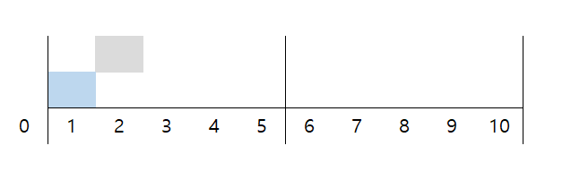
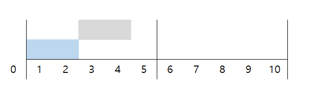
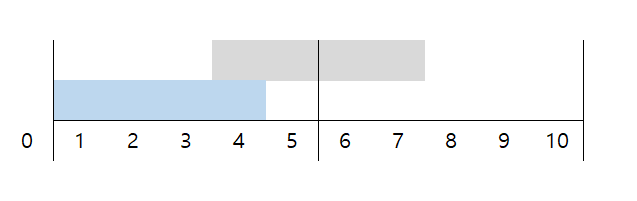
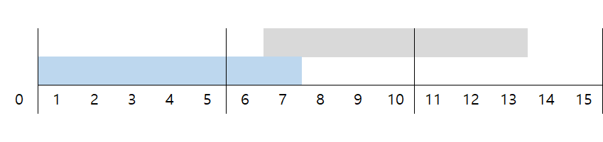
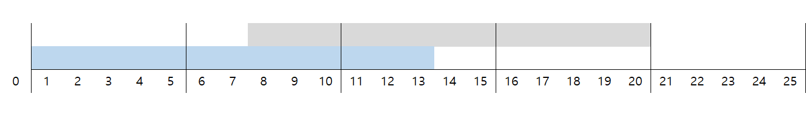
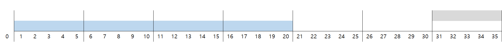
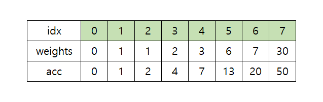

# 개요

매우 복잡해보이는 문제가 `그림으로 풀면 매우 단순하게 풀리는 경우`는 그리 드문일이 아닙니다. 이 문제는 수학적 귀납법으로도 풀 수 있지만, 수직선을 사용하면 훨씬 직관적이고 쉽게 풀립니다. 핵심은 `측정할 수 있는 무게의 구간을 끊기지 않게 확장시키는 것` 입니다.

---

# 핵심

현재 `닫힌구간 [1, 10]`을 측정할 수 있는 상태에서 `무게가 5`인 무게추가 더 주어졌다면, `기존에 측정할 수 있었던 무게 + 5`를 측정할 수 있으므로, `1부터 10까지 순회하면서 5를 더한값`을 추가로 측정할 수 있습니다. 즉, `닫힌구간 [1+5, 10+5]`를 추가로 측정할 수 있습니다.

---



---

그렇다면 `닫힌구간 [1, 5]`를 측정할 수 있는 상태에서 `무게가 7`인 무게추가 더 주어지면 어떻게 될까요? `닫힌구간 [1, 12]`를 전부 커버할 수 있을까요? 아래 그림을 살펴보면 `닫힌구간 [6, 7]`이 측정될 수 없음을 알 수 있습니다.

---



---

# 예제 풀이

예제입력 1번에 해당 아이디어를 적용해보겠습니다.

```text
7
3 1 6 2 7 30 1
```

---

측정할 수 없는 가장 가벼운 무게를 구하는데, 무거운 추부터 사용하는 것은 올바르지 않으므로, 다음과 같이 `오름차순으로 정렬`합니다.

```text
7
1 1 2 3 6 7 30
```

---

**Step 1**

```
v
1 1 2 3 6 7 30
```

처음에는 측정할 수 있는 구간이 없으므로 `[0, 0]`으로 가정합니다. 이 상태에서 무게가 1인 무게추가 더 주어지면 `[1, 1]`을 추가로 측정할 수 있습니다. 두 구간은 끊어지지 않으므로 `[0, 1]`로 퉁칠 수 있습니다.



---

**Step 2**

```
  v
1 1 2 3 6 7 30
```

측정가능한 구간이 `[0, 1]`인 상태에서 무게가 1인 무게추가 더 주어지면 `[1, 2]`를 추가로 측정할 수 있습니다. 두 구간은 끊어지지 않으므로 `[0, 2]`로 퉁칠 수 있습니다.



---

**Step 3**

```
    v
1 1 2 3 6 7 30
```

측정가능한 구간이 `[0, 2]`인 상태에서 무게가 2인 무게추가 더 주어지면 `[2, 4]`를 추가로 측정할 수 있습니다. 두 구간은 끊어지지 않으므로 `[0, 4]`로 퉁칠 수 있습니다.



---

**Step 4**

```
      v
1 1 2 3 6 7 30
```

측정가능한 구간이 `[0, 4]`인 상태에서 무게가 3인 무게추가 더 주어지면 `[3, 7]`를 추가로 측정할 수 있습니다. 두 구간은 끊어지지 않으므로 `[0, 7]`로 퉁칠 수 있습니다.



---

**Step 4**

```
        v
1 1 2 3 6 7 30
```

측정가능한 구간이 `[0, 7]`인 상태에서 무게가 6인 무게추가 더 주어지면 `[6, 13]`을 추가로 측정할 수 있습니다. 두 구간은 끊어지지 않으므로 `[0, 13]`으로 퉁칠 수 있습니다.



---

**Step 5**

```
          v
1 1 2 3 6 7 30
```

측정가능한 구간이 `[0, 13]`인 상태에서 무게가 7인 무게추가 더 주어지면 `[7, 20]`을 추가로 측정할 수 있습니다. 두 구간은 끊어지지 않으므로 `[0, 20]`으로 퉁칠 수 있습니다.



---

**Step 6**

```
            v
1 1 2 3 6 7 30
```

측정가능한 구간이 `[0, 20]`인 상태에서 무게가 30인 무게추가 더 주어지면 `[30, 50]`을 추가로 측정할 수 있습니다. 두 구간은 연속되지 않으므로, 이 두 구간 중간에 위치한 구간은 측정할 수 없습니다. 따라서 측정 불가능한 최소 무게는 21입니다.



---

# 누적합으로 풀기

예제풀이로 알 수 있듯이, 이 문제의 키 포인트는 `이전구간과 새롭게 생긴 구간이 연속되는가?`를 판단하는 것입니다.

---

지금까지 구간이 끊기지 않았다면, 기존 구간은 `[0, E]`의 형태일 것이고, `E`는 지금까지 사용했던 `무게추의 누적합`과 같을 것입니다. 이유를 좀 더 설명해보자면 `E`는 측정할 수 있는 무게의 최대값이죠? N개의 무게추를 사용하여 측정할 수 있는 무게의 최대치는, N개 모두를 사용했을 때의 무게이기 때문입니다.

---

거의 다왔습니다. `[0, acc[i-1]]`인 상태에서 무게가 `weights[i]`인 무게추가 더 주어진다면, 구간 정보는 다음과 같고:

-   기존 구간 : `[0, acc[i-1]]`
-   신규 구간 : `[weights[i], acc[i]]`

---

위의 두 구간이 끊어지지 않으려면 `weights[i] <= acc[i-1] + 1`을 만족해야 함을 알 수 있습니다.

---

예제입력에서는 `i=7`에서 조건이 만족되지 않으므로, 7번째 무게추가 들어올 때 구간이 끊어졌겠죠? 끊어진 구간의 첫 번째 값이 `측정할 수 없는 최소값`이므로, `21(=20+1)`이 정답입니다.



---

# 추가 테스트케이스

## 1번

**input :**

```text
1
1
```

**expect:**

```text
2
```

---

## 2번

**input :**

```text
1
2 3
```

**expect:**

```text
1
```

---

## 3번

**input :**

```text
4
1 1 1 1
```

**expect:**

```text
5
```

---

## 4번

**input :**

```text
3
1 2 4 16
```

**expect:**

```text
8
```

---

## 5번

**input :**

```text
7
3 1 6 2 7 30 1
```

**expect:**

```text
21
```

---
