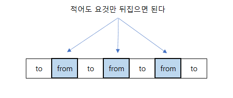
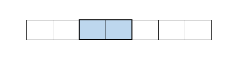
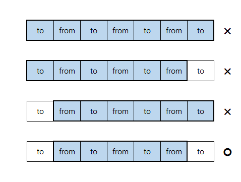
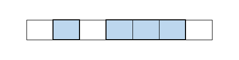

# 개요

어떤 문제들은 입력을 짧게 치환해도 상관없는 경우가 있습니다. 이 문제가 그러한 것 중의 하나이며, 이 문제를 쉽게 풀려면 `연속된 구간을 압축`해야 합니다. 특정 값이 연속되는 구간은 `나중에 같이 뒤집혀져야 하므로`, 각 구간을 대표값 하나로 축약할 수 있겠죠.

**축약 전:**

```text
1100000011
```

**축약 후:**

```text
101
```

---

# 직관적으로 풀기

## 입력형식 되새김하기

이제 우리는 `숫자가 연속되는 경우`를 생각할 필요가 없습니다. `from`을 `to`로 바꿔야 한다고 했을 때, 다음과 같이 간략화된 입력만 생각하면 되는 것입니다.

**from으로 시작하는 경우:**

```text
from
from-to
from-to-from
from-to-from-to
...
...
```

---

**to로 시작하는 경우:**

```text
to
to-from
to-from-to
to-from-to-from
...
```

---

## 결과의 최대값 유추하기

이 문제를 푸는, 가장 간단하게 떠올릴 수 있는 방법은 `모든 from을 to로 뒤집는 것`이겠죠? 따라서 최소횟수는 `적어도 from의 개수를 넘지 않는다`는 것을 이끌어낼 수 있습니다.



---

**from을 to로 바꾸는 최소횟수:**

-   `0 -> 1`: 최대 0의 개수를 넘지 않는다.
-   `1 -> 0`: 최대 1의 개수를 넘지 않는다.

---

## 다르게 뒤집을 수 있나?

### 새로운 방법 찾기

각각의 `from`을 `to`로 바꾸는 것 말고, 다른 방식으로 뒤집을 수 있는 방법이 있을까요? 그러한 방법이 있다면 `from으로 둘러쌓인 연속된 구간이 동시에 뒤집어지는 형태`겠죠.

---

증명해보자면, 먼저 각각의 `from`을 `to`로 바꾸는 방식은 1개 구간만 뒤집는 방법이므로, 이 방법이 최적이 아니라면 `2개 이상의 연속된 구간을 동시에 뒤집는 방법`이겠죠.



이렇게 만들어진 연속된 구간에서, 양쪽 둘 중 하나가 `to`인 경우에는 `to`를 빼버려서 구간을 축소하는 것이 더 효율적인 선택입니다. 굳이 영역에 포함시켜서 `from`으로 만들 이유가 있냐는 것이죠. 중간에 끼어있는 `to`는 어쩔 수 없이 포함된 것이지만, 양쪽끝의 `to`는 빠질려면 빠질 수 있거든요.



또한 입력에서 `from`과 `to`는 교대로 나타나므로, 양쪽 둘이 `to`가 아니게 만드려면 구간의 길이는 홀수여야 함을 알 수 있습니다.



---

### 이 방법으로도 풀어보기

기존의 방식(`1개씩 뒤집기`)과 새로운 방식(`N개 동시에 뒤집기`) 둘 중에 어느 것이 더 뛰어난지 명확하게 판단할 수 없으므로, 두 방식으로 모두 풀어봐야겠죠. 따라서 새로운 방식으로 문제를 어떻게 풀 수 있는지 생각해야 합니다.

---

먼저 위에서 추론한 내용을 바탕으로, 새로운 방식이 적용되는 부분구간의 형태는 다음과 같습니다:

-   구간의 길이는 홀수
-   `from`으로 둘러쌓여야 함

```text
from
from-to-from
from-to-from-to-from
from-to-from-to-from-to-from
```

위의 부분구간은 동시에 뒤집히기 때문에, 다음과 같이 변환되고:

```text
to
to-from-to
to-from-to-from-to
to-from-to-from-to-from-to
```

양쪽의 `to`는 필요없으므로, 다시 다음과 같이 축소됩니다 :

```text
x
from
from-to-from
from-to-from-to-from
```

재귀적으로 풀어갈 수 있다는 것을 눈치채셨나요? 이 방법으로 구간의 길이가 `2N+1`인 부분구간을 뒤집을 때 필요한 횟수는 `N+1`이고 이것은 `from의 개수`입니다.

---

즉 `각각을 뒤집으나` `동시에 뒤집으나` 차이가 없다는 것을 알아냈으므로, 원래 입력을 무수히 많은 부분구간으로 분할해도 `from`의 개수에서 벗어나지 않을겁니다. 부분구간을 풀어내도 `from의 개수`가 튀어나오기 때문입니다.

```text
      2                 2
(from-to-from)-to-(from-to-from)
```

따라서, 둘 중 하나가 정답입니다.

-   `from=0, to=1`인 경우, 양쪽 끝이 아닌 `0`의 개수.
-   `from=1, to=0`인 경우, 양쪽 끝이 아닌 `1`의 개수.

---

# 추가 테스트케이스

## 1번

**input :**

```text
0
```

**expect:**

```text
0
```

---

## 2번

**input :**

```text
0011100
```

**expect:**

```text
1
```

---

## 3번

**input :**

```text
11000001
```

**expect:**

```text
1
```

---

## 4번

**input :**

```text
1010
```

**expect:**

```text
2
```

---

## 5번

**input :**

```text
101010101
```

**expect:**

```text
4
```
