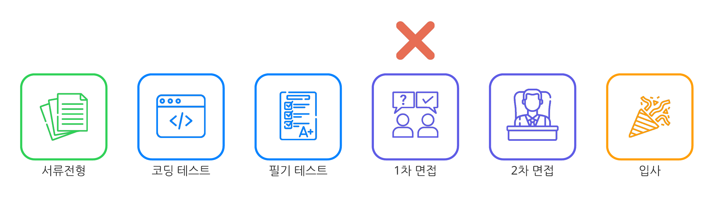
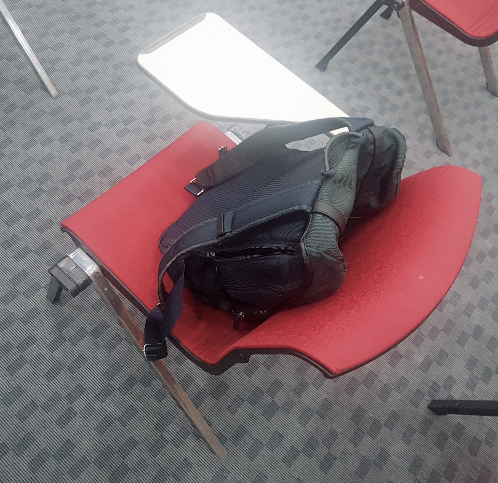
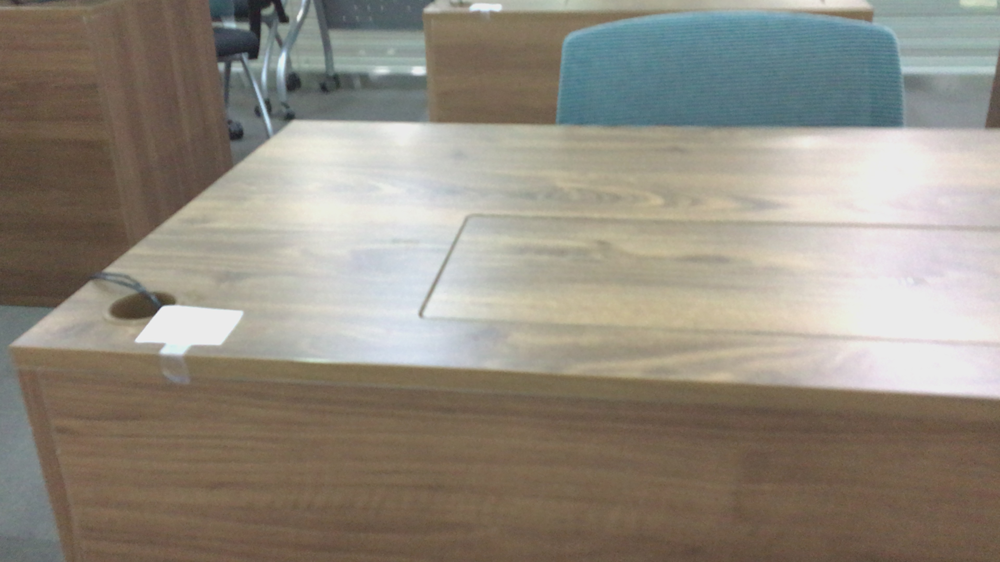
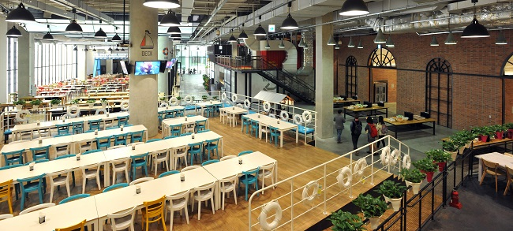

# 시작하기에 앞서

한참 전에 있었던 일을 지금 회고한다는 것이 조금 아이러니하지만, 기억이 더 바래지기 전에 회고록을 작성합니다. 따라서 실제 공채시기와 포스팅 작성일에는 1년 정도의 차이가 있으며, `코로나가 발생하기 전`에 진행된 공채임에 유의해주세요.

---

# 채용 프로세스

-   결과 : `1차 면접 탈락`

---

# 서류전형

**일정 :**

-   서류접수 : `08.26(월) ~ 09.17(화)`
-   결과발표 : `09.19(목)`

---

NHN의 서류전형은 굉장히 널널하기로 유명합니다. 물어보는 항목이 쉽다는 뜻이 아니고, 뒤에 이어질 전형들이 어렵기로 유명하기 때문에 `지금 일단 서류는 다 받아둘게`라는 의미가 큰 것 같습니다. 다른 회사의 공채에서도 물어볼법한 기본적인 사항만 물어봅니다.

-   기본적인 인적사항 (학력, 성적, 자격증, ...)
-   왜 우리 회사에 지원했나요?
-   어려웠던 문제를 해결해본 경험은?
-   학부 시절에 배웠던 가장 자신있는 과목 3개와 그 이유는?

---

# 1차 프리테스트

**일정 :**

-   시험일자 : `09.29(일) 10:00 ~ 12:00`
-   결과발표 : `10.01(화)`
-   플랫폼 : `구름`
-   문항수 : `4개`

---

흔히들 말하는 `코딩 테스트`이며, 자회사에서 운영하는 `구름 IDE 플랫폼`을 사용하여 시험을 진행했습니다. 지금은 상당히 괜찮아졌지만, 당시 구름은 `자동완성을 지원하지 않는 등` 기능이 매우 열악했습니다. 원래 사용하던 IDE에서 코딩을 하고, 구름에는 복붙만 하는게 오히려 낫았죠. 당시 구름의 악명은 상당히 높았습니다. 😥

---

반면에 문제 난이도와 합격컷 자체는 다른 대기업들에 비해 상당히 낮았는데, 문제 자체도 여럽지않을 뿐더러 `2문제만 풀었는데도 합격했다`는 분들도 많았습니다. 다른 대기업의 합격컷에 비교하면 상당히 후했습니다.

---

# 2차 프리테스트

**일정 :**

-   시험일자 : `10.06(일) 14:00 ~ 16:00`
-   시험장소 : `경기 창조경제혁신센터` 또는 `NHN 플레이뮤지엄`
-   시험방식 : `OMR`
-   시험과목 : `운영체제`, `네트워크`, `컴퓨터구조`, `데이터베이스`, `자료구조`, `알고리즘`, `프로그래밍 일반`
-   결과발표 : `10.11(금)`

---

흔히들 말하는 `필기 테스트`이며, 코로나 발생 전이라 `오프라인`으로 고사장에서 문제를 풀었습니다. 시험범위가 넓고 자세하게 물어보기 때문에 여기서 대거 탈락하는 분들이 많았습니다. `운영체제`와 `네트워크`가 준비하기 까다로웠는데, 운영체제는 어쩔 수 없이 공룡책을 정독했고, 네트워크는 나올만한 부분만 공부했습니다. 공룡책이 없으신 분들은 [`여기`](https://aerocode.net/369)에 내용을 따로 정리했으니 참조하시면 됩니다.

---

여담이지만, 이 시험에는 사소한 `복불복`이 있었습니다. 시험자들에게 전부 동일한 책상을 제공할 수 없었기 때문에, 사소한 `자리운`이 있었던 것이죠. 현실적으로 어쩔 수 없다는 것을 알지만, 이 부분이 약간 아쉬웠습니다.

---

**복불복 책상 1:**

**복불복 책상 2:**

---

# Feel The TOAST

**일정 :**

-   일자선택 : `10.21(월) ~ 10.27(금)` 중 하루 선택
-   진행시간 : `09:00 ~ 18:30`
-   내용 :
    -   오전 코딩 테스트 - 시험 (`09:30 ~ 12:00`)
    -   점심 식사
    -   오전 코딩 테스트 - 코드 리뷰
    -   회사 둘러보기
    -   기술 면접
-   결과발표 : `11.05(화)`
-   면접비 : `페이코 포인트 5만원`

---

NHN에서 자랑하는 `일일체험 전형`입니다. 하루동안 NHN의 멤버가 되서 에네첸의 하루를 느껴보는 전형이죠. 덧붙여 하루동안 판교인이 된 것 같은 느낌을 줍니다. 비록 탈락했지만, 취지와 필링은 매우 좋았어요. 기회가 닿으면, 다시 한번 느껴보고 싶을 정도입니다.

---

## 전날에 숙소잡기

진행시간에서 알 수 있듯이 `09:00 전에 플레이 뮤지엄에 도착`해야 합니다. 따라서, 경기도가 아닌 다른 분들은 `숙소를 잡아놔야` 정신건강에 이롭습니다. 물론 당일에 출발하더라도, 시간을 맞출 수 있는 분은 괜찮지만요.

---

숙박비용은 1박에 평균 7만원인데, 돈을 아끼고 싶어서 새벽에 출발하는 기차나 버스가 있는지 확인했지만, 도저히 9시 전에 도착할 수 있는 배차가 없길래, 눈물을 머금고 숙소를 예약했습니다. 😭

---

## 오전 코딩 테스트

이번에는 꽤 난이도있는 문제 하나를 주고, 점심시간 전까지 내내 풉니다. 당시에는 `또 코딩 테스트야??`, `이거 못풀면 합격 못하는거야??` 라는 의문이 들었지만, 나중에 찬찬히 생각해보니 `코드 리뷰를 위한 코딩 테스트` 그 이상 그 이하도 아니였습니다. 못 풀어도 합격여부에는 영향이 없었다고 합니다.

---

결과메일이 날아올 때, 오전 코딩 테스트에서 작성한 코드에 대해 좋은점과 개선할점이 상세하게 적혀있었는데, NHN이 자랑하는 좋은 개발문화 중 하나가 `꼼꼼한 코드 리뷰`였기 때문에, 그 문화를 지원자에게 느끼게 해주고 싶은 것이 아니였을까요.

---

## 점심식사

오전 코딩을 다 끝내면, NHN의 사내식당인 `포트 629`에서 점심을 먹을 수 있습니다. 기억해둘 사항으로는 `삼시세끼 무료`, `수요일은 특식`라는 점입니다. 혹시 플레이뮤지엄에서 점심을 먹을 일이 있다면 수요일로 잡아보세요. 제가 면접봤던 날의 점심메뉴는 `스테이크`였습니다.

---

## 오전 코딩 테스트 - 리뷰

`3인 1조`로 짝을 이뤄서, 오전에 작성했던 코드의 리뷰를 진행합니다. 팀장급의 현직자분들이 리뷰를 해주시는데 `나쁜 습관`과 `반례`등에 대해서 알려주십니다. 한명씩 돌아가면서 리뷰해주시는데, 딱히 지적할 것이 없다면 차례가 금방 넘어갑니다.

---

당시에 응시자들이 많이 받았던 개선사항으로는 :

-   항상 최악의 케이스로 메모리를 할당하지 마세요. (=쓸 만큼만 할당하세요.)
-   오버 플로우를 항상 염두하세요. (오버플로우가 발생할 수 있는 문제였음.)
-   코드가 반복되지 않도록하세요.
-   객체 지향적으로 작성하세요.
-   주석을 상세하게 다세요.

---

## 기술 면접

합탈여부는 오로지 이 기술면접에서 정해지기 때문에, 사실상 필더토스트의 핵심이라고 봐도 무방합니다. 각 방에 들어가면 면접관분이 빈종이를 스윽하고 내미시는데, 면접관님이 문제를 내면 바로 그 자리에서 풀면 됩니다. 당시에는 `총 3문제`가 있었습니다.

---

문제를 못 풀어서 끙끙 앓고 있으면, `이렇게 생각하면 어때요?`, `다른 방법은 뭐가 없을까요?`하고 면접관님이 힌트를 던져주십니다. 면접관님들이 하는 말이 백퍼센트 옳기 때문에, 힌트를 잘 주워담아서 생각해야 합니다.

---

NHN 공식 유튜브와 다른 분들의 블로그 후기에서 나온 `합격 팁`을 종합하면 :

-   바로 못풀어도 괜찮습니다. 면접관님이 힌트를 지속적으로 주십니다.
-   자신이 생각한 가정이 적절한지 면접관님에게 물어보세요. 그 가정이 적절한지 면접관님이 알려줄 수 있습니다.
-   힌트를 줬을 때, 어려운 문제를 풀 수 있는지에 대한 여부를 판단하는 것 같습니다.
-   백준이나 프로그래머스가 기술면접에 상당히 도움이 됩니다.
